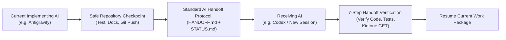

# Multi-AI Handoff & Continuity Protocol (CORE GOVERNANCE)

> **Document Status:** Complete (Provider-Neutral Governance Standard)  
> **Applicability:** All AI Assistants (Antigravity, OpenAI Codex, Claude, etc.)  
> **Core Principle:** AI Can Change, Project Truth Must Not Change  
> **Last Updated:** 2026-08-24  

---

## 1. The Multi-AI Operating Model

This repository is designed to be fully **AI Provider-Independent**. Conversation memory of any individual AI is ephemeral and must never serve as the primary source of truth. The authoritative source of truth is strictly the **Git Repository, Living Documentation, Defect Register, and Test Evidence**.

---

## 2. Mandatory Reading Order for Every AI Session

Before proposing or making ANY changes, the incoming AI must read the following documents in exact order:

1. `project-docs/AI_START_HERE.md` (Project orientation & rules)
2. `project-docs/AI_HANDOFF_PROTOCOL.md` (This handoff protocol)
3. `project-docs/IMPLEMENTATION_STATUS.md` (Authoritative current phase & scope)
4. `project-docs/CURRENT_STATE.md` (Live technical baseline)
5. `project-docs/HANDOFF.md` (Operational handoff & exact next action)
6. `project-docs/implementation/FINAL_IMPLEMENTATION_BLUEPRINT.md` (Target specification)
7. Relevant Frozen Architecture Blueprints (`project-docs/architecture-redesign/`)
8. `project-docs/BUSINESS_RULES.md` (Confirmed business logic)
9. `project-docs/DECISIONS.md` (Immutable architectural decision log)
10. `project-docs/OPEN_ISSUES.md` (Open items tracking)
11. `project-docs/DEFECT_REGISTER.md` (Active bugs & resolutions)
12. Relevant Test Matrix (`project-docs/architecture-redesign/*TEST_MATRIX.md`)

---

## 3. Work Package & Change Traceability Standard

Every code modification, schema change, test execution, defect fix, and commit must reference a structured **Work Package ID**:
`MBO-P{PHASE}-WP-{NUMBER}`
*Example:* `MBO-P05-WP-001` (Phase 5, Work Package 1: Twin-Status Engine Schema).

Traceability Pipeline:
`Decision / Requirement` -> `Work Package` -> `Code / Kintone Change` -> `Test Evidence` -> `Commit` -> `Handoff`

---

## 4. Defect Management Standard
All defects are logged in `project-docs/DEFECT_REGISTER.md` using the standard format:
`MBO-P{PHASE}-DEF-{NUMBER}`
*Defect Lifecycle:* `OPEN` -> `IN_PROGRESS` -> `FIXED_PENDING_RETEST` -> `CLOSED`.  
*Rule:* **No new features may be implemented while active defects block the current phase gate.**

---

## 5. Standard Handoff Protocol (Current AI -> Repository)

Before ending a session or handing off work, the current AI must execute the **Handoff Checkpoint**:
1. **Stop Development:** Freeze code changes for the current task.
2. **Run Tests:** Execute unit/integration test suites (e.g. `npm test`) and capture real evidence.
3. **Verify Kintone State:** Verify Kintone schema via read-only GET operations if applicable.
4. **Update Registers:** Update `DEFECT_REGISTER.md` and `IMPLEMENTATION_STATUS.md`.
5. **Update Handoff Docs:** Update `CURRENT_STATE.md`, `HANDOFF.md`, and `CHANGELOG_AI.md`.
6. **Git Sync:** Perform `git status`, commit with descriptive message, and `git push origin develop`.
7. **Report Safe Point:** Report the Last Safe Commit hash and exact next action.

---

## 6. Receiving AI Verification Protocol (Repository -> Receiving AI)

When an incoming AI begins a session, it must execute the **7-Step Verification**:
1. **Step 1:** Read all mandatory documents in the prescribed order.
2. **Step 2:** Inspect Git branch and verify the current commit matches `Last Safe Commit`.
3. **Step 3:** Compare `HANDOFF.md` against `IMPLEMENTATION_STATUS.md`.
4. **Step 4:** Verify that all affected project files exist locally.
5. **Step 5:** Perform read-only GET verification against Kintone if phase requires.
6. **Step 6:** Run smoke test suite (`npm test`) to confirm baseline health.
7. **Step 7:** Output the **AI Handoff Verification Report** declaring `HANDOFF VERIFIED` or `HANDOFF BLOCKED`.
