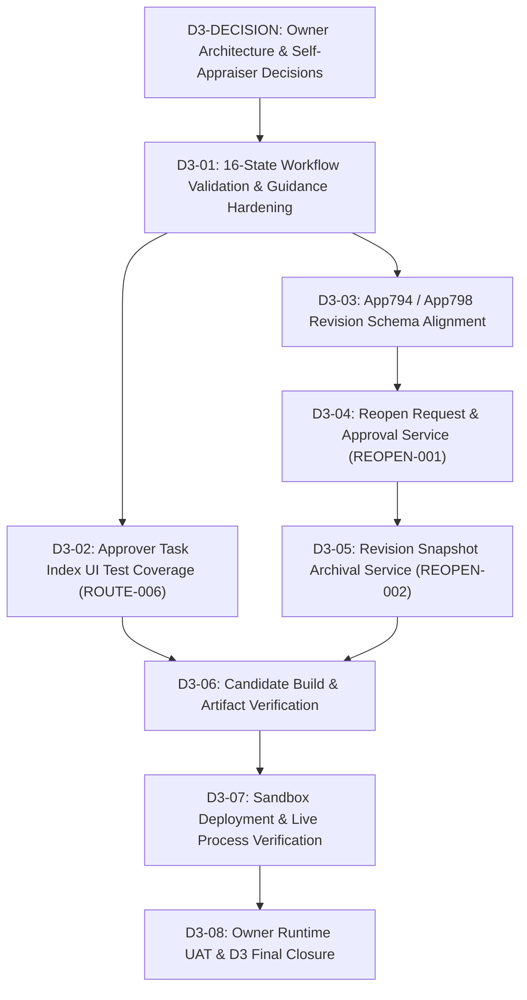

# D3-PRE1: Workflow / Reopen Scope & Readiness Gap Review (R1 Corrective)

Date: 2026-09-08 ICT
Work Package: `D3-PRE1` (Corrected by `D3-PRE1-R1`)
Type: `EVIDENCE-ONLY / READ-ONLY ANALYSIS`
Branch: `ai/antigravity-wp002c`
Repository: `rebootob/MBO2026`
Starting HEAD: `d9082e46d579fccd125cec2b9aceeaa804b959b9`
Author: Antigravity Execution Plane
Review Target: Human Owner & ChatGPT Control Plane

---

## 1. Executive Summary & Readiness Verdict

### 1.1 Verdict
```text
D3_READINESS = OWNER_DECISION_REQUIRED
D3_CURRENT_STATUS = HOLD / NOT AUTHORIZED
D3_IMPLEMENTATION_AUTHORIZED = NO
```

Stage D3 cannot proceed to implementation because repository truth reveals two unresolved material architectural/contractual conflicts:
1. **Architecture Authority Conflict**: The live, deployed App 794 Rev 70 Process Management implements a **16-State / 28-Action model** (documented in `CONFIRMED_BASELINE/ROUTING_WORKFLOW.md`), whereas `architecture-redesign/GENERIC_ROUTING_ARCHITECTURE.md` and `BUSINESS_RULES.md` §8 declare a **45-State Generic Twin-Status model** as **`FROZEN`**. No explicit Owner or Control Plane decision currently exists in repository authority superseding either architecture.
2. **Self-Appraiser Contract Conflict**: The confirmed baseline (`ROUTING_WORKFLOW.md`) mandates **Fail-Closed (`SELF_APPROVAL_ROUTE_CONFLICT`)**, whereas source code (`src/services/routing-service.js`) implements **Self-Appraiser Elision and slot shifting**. The frozen baseline was never formally amended.
3. **Reopen/Revision Implementation & Schema Gaps**: While App 798 (Revision Archive) has a deployed 15-field schema on Sandbox, App 794 has zero revision fields, and `src/` has zero lines of code for Reopen requests, approvals, or archival snapshots.

### 1.2 Summary of Findings
1. **16-State vs 45-State Authority Conflict**:
   - **As-Built Runtime**: App 794 (Live Revision 70) is configured with **16 states and 28 actions**. The codebase (`src/validation/validation-engine.js`, `src/services/routing-service.js`, `src/ui/status-guidance-ui.js`, `src/ui/approver-task-index-ui.js`) and baseline document (`project-docs/CONFIRMED_BASELINE/ROUTING_WORKFLOW.md`) support this 16-state model.
   - **Frozen Target Architecture**: `project-docs/architecture-redesign/GENERIC_ROUTING_ARCHITECTURE.md` explicitly declares `GENERIC_ROUTING_ARCHITECTURE = FROZEN` (45 native statuses, 6 generic approval slots with twin-status `ALL`/`ANY` pairs + dedicated HR Final Check).
   - **Classification**: `ARCHITECTURE_AUTHORITY_CONFLICT = YES`. Requires Owner decision (`DECISION-D3-001`).

2. **Self-Appraiser Authority Conflict**:
   - Confirmed baseline (`ROUTING_WORKFLOW.md`, commit `dc049ad`) states: "If an employee's own MBO resolves to the same Kintone user as an Appraiser/Approver, runtime must fail closed: `SELF_APPROVAL_ROUTE_CONFLICT`. Do not silently skip that appraiser, auto-approve, or reinterpret the route."
   - Source code (`src/services/routing-service.js`, commit `20747ef`) implements `applyOwnMboSelfAppraiserElision` which removes self from approver slots and recalculates topology.
   - Classification: `SELF_APPRAISER_AUTHORITY = UNRESOLVED_CONTRACT_CONFLICT`. Requires Owner decision (`DECISION-D3-002`).

3. **Workflow Engine Reality**:
   - Transitions are executed **natively by the Kintone Process Management UI**, not via programmatic REST API (`/k/v1/record/status.json`).
   - The client-side code (`src/main-mbo-app.js`) intercepts native transitions (`app.record.detail.process.proceed`) to run `ValidationEngine.validateWorkflowAction` and `ValidationEngine.validate`.
   - User guidance is provided by `StatusGuidanceUI` and `ApproverTaskIndexUI`.

4. **Reopen & Revision Reality**:
   - **App 798 (MBO Revision Archive)** schema container is deployed on Sandbox with 15 fields defined in `config/schema-spec.js` (verified by canonical repository evidence in `project-docs/APP_REGISTRY.md`, `config/sandbox-apps.json`, and delivery documentation).
   - **App 794 Schema Gap**: App 794 does NOT have revision counter fields (`Revision_Number`, `Objective_Revision`, `Evaluation_Revision`).
   - **Implementation Gap**: Zero service, UI, or test code exists in `src/` for Reopen requests, approvals, or snapshot archival to App 798.

5. **D1/D2 Carryover Status**:
   - `OBJ-003` (Copy Previous Year Objectives): Implemented in `src/services/copy-previous.js` (6 passing unit tests). Non-blocking carryover.
   - `ROUTE-006` (Approver Task Index UI): Implemented in `src/ui/approver-task-index-ui.js` and wired in `src/main-mbo-app.js`. Lacks dedicated unit tests; should be verified in D3.
   - `SCORE-005` & `SCORE-006`: Handled natively by Kintone CALC fields on App 794.

---

## 2. D3 Candidate Function Matrix & Source/Test/Deploy Status

| Function ID | Name | Matrix Status | Source Reality | Test Reality | App794 Deployment Reality | Gap Type |
|---|---|---|---|---|---|---|
| `ROUTE-004` | Workflow action executions and state transitions | `DEFINED` | **Partial**: `src/main-mbo-app.js` listens to `app.record.detail.process.proceed` and invokes `ValidationEngine.validateWorkflowAction`. State transitions occur via native Kintone UI. | Covered indirectly in `tests/validation-engine.test.js` (action validation), but 0 end-to-end process transition tests. | Native 16-state Process Management configured in App 794 Rev 70. | Implementation & Verification Gap (no programmatic action execution; UI hook only) |
| `REOPEN-001` | Post-approval reopen request handler | `DEFINED` | **Zero source**: No handler, no service, no UI in `src/`. | **Zero tests**: 0 tests in `tests/`. | Not configured in App 794. | Pure Implementation Gap |
| `REOPEN-002` | Evaluation revision versioning guard | `DEFINED` | **Zero source**: No archival snapshot service, no revision bump logic. | **Zero tests**: 0 tests in `tests/`. | App 798 schema deployed in Sandbox; App 794 lacks revision fields. | Schema Gap on App 794 + Implementation Gap |
| `ROUTE-006` *(Carryover)* | Approver Task Index UI | `IMPLEMENTED` | **Exists**: `src/ui/approver-task-index-ui.js` wired in `src/main-mbo-app.js`. | **Zero dedicated tests**: No unit tests in `tests/`. | Deployed live in Rev 70 JS bundle. | Test Gap |
| `OBJ-003` *(Carryover)* | Copy Previous Year Objectives | `TESTED` | **Exists**: `src/services/copy-previous.js`. | **6 unit tests**: `tests/copy-previous.test.js` PASS. | Deployed live in Rev 70 JS bundle. | Verification / Documentation Gap |

---

## 3. 16-State Production Model vs 45-State Generic Architecture Analysis

### 3.1 Architectural Conflict Breakdown

```text
+-------------------------------------------------------------------------------+
|                        ARCHITECTURE AUTHORITY CONFLICT                        |
+-------------------------------------------------------------------------------+
| AS-BUILT CURRENT RUNTIME                  | FROZEN TARGET ARCHITECTURE        |
| (ROUTING_WORKFLOW.md / App 794 Rev 70)    | (GENERIC_ROUTING_ARCHITECTURE.md) |
+-------------------------------------------+-----------------------------------+
| 16 Discrete States                        | 45 Combinatorial States           |
| 28 Specific Actions                       | 6 Generic Slots x ALL/ANY Pairs   |
| Deployed & Verified on App 794 Rev 70     | Labeled FROZEN in Repo (08-24)    |
| Supported by validation-engine.js         | No Supporting Code in src/        |
| Specific Roles (Manager, GM, HR)          | Abstract Step Numbers (Step 1..6) |
| Low Implementation Scope                  | High Overhaul Scope               |
+-------------------------------------------+-----------------------------------+
```

### 3.2 Detailed Comparison

1. **State Space**:
   - **Canonical 16-State Model (`ROUTING_WORKFLOW.md`)**:
     - **Goal Setting**:
       `01 Draft Objective` -> `03 Manager Objective Review` -> `04 GM Objective Review` -> `05 Objective Approved`
     - **Mid-Year**:
       `05 Objective Approved` -> `06 Employee Mid-Year` -> `08 Manager Mid-Year Review` -> `09 GM Mid-Year Review` -> `10 Mid-Year Completed`
     - **Final Evaluation**:
       `10 Mid-Year Completed` -> `11 Employee Self Evaluation` -> `13 Manager Final Evaluation` -> `14 GM Final Evaluation` -> `15 HR Final Check` -> `16 Completed`
     - **First-Manager States (for compatible M2 topology)**:
       `02 First Manager Objective Review`, `07 First Manager Mid-Year Review`, `12 First Manager Final Evaluation`
     - **Return / Resubmit Paths**:
       - Objective Manager/GM return -> `01 Draft Objective`
       - Mid-Year Manager/GM return -> `06 Employee Mid-Year`
       - Final Manager/GM return -> `11 Employee Self Evaluation`
       - HR Final return -> `11 Employee Self Evaluation`
   - **Frozen 45-State Model (`GENERIC_ROUTING_ARCHITECTURE.md`)**:
     - Generic 6-step pipeline where each step has dual states: `Step N - ALL` (all approvers in slot must approve) and `Step N - ANY` (any single approver can approve), repeated across 3 macro phases (Objective, Mid-Year, Final) = 36 states + Draft, Return, Completed, and dedicated `HR_FINAL_CHECK` = 45 native statuses.

2. **Classification**:
   - `ARCHITECTURE_AUTHORITY_CONFLICT = YES`.
   - Neither model has been formally superseded by an explicit Owner or Control Plane decision.
   - **Owner Decision Required (`DECISION-D3-001`)**:
     - **Option A**: Adopt current 16-state / 28-action model as D3 V1 canonical and explicitly supersede/defer the 45-state generic architecture for the current release.
     - **Option B**: Retain the 45-state FROZEN target and treat the current 16-state process as interim/as-built requiring migration.

---

## 4. Workflow Action Execution Reality (UI Hooks vs Programmatic Transitions)

### 4.1 Current Repository Implementation
In `src/main-mbo-app.js`:
```javascript
kintone.events.on('app.record.detail.process.proceed', async (event) => {
  // 1. Intercept native Kintone Process Management action
  // 2. Validate current record and action using ValidationEngine
  // 3. Return event (allow transition) or set event.error (block transition)
});
```
- There is **NO programmatic status transition service** (no `/k/v1/record/status.json` PUT calls in client JS).
- All status transitions are triggered by the **user clicking native Kintone Process Management action buttons**.
- When an action button is clicked, Kintone fires `app.record.detail.process.proceed`. The custom script runs validation guards to permit or deny the transition.

### 4.2 Architectural Assessment
- **Native UI Sufficiency**: Native Kintone Process Management enforces assignees, preserves audit history, and respects Kintone security.
- The role of `ROUTE-004` is:
  1. Strict pre-condition validation before allowing the native action to proceed (scores filled, comments provided, valid topology).
  2. Rendering clear `StatusGuidanceUI` explaining who must act next and what native action button to press.
  3. Blocking unauthorized native actions with informative error banners.

---

## 5. Assignee, Routing & Self-Appraiser Conflict Analysis

### 5.1 Route Resolution & Assignee Discovery
- `src/services/routing-service.js`: Fetches route from App 795 and resolves roles (`First_Manager_User`, `Manager_User`, `GM_User`).
- `src/services/mbo-approval-task-service.js`: Queries App 794 for active assignees matching `Assignee in (LOGINUSER())`.
- `src/ui/approver-task-index-ui.js`: Displays pending approval tasks on the App 794 index view.

### 5.2 Material Self-Appraiser Contract Conflict
- **Frozen Baseline (`ROUTING_WORKFLOW.md`, commit `dc049ad`)**:
  ```text
  If an employee's own MBO resolves to the same Kintone user as an Appraiser/Approver, runtime must fail closed:
  SELF_APPROVAL_ROUTE_CONFLICT
  Do not silently skip that appraiser, auto-approve, or reinterpret the route. A business exception requires a separate explicit rule and review.
  ```
- **Current Source Implementation (`src/services/routing-service.js`, commit `20747ef`)**:
  - Implements `RoutingService.applyOwnMboSelfAppraiserElision(routeProfile, currentDedicatedUserCode, isOwnMbo)`:
    - Removes self from approver array.
    - Preserves surviving slots and shifts remaining approvers left.
    - Recalculates `Routing_Topology` (e.g. `M1_G1` becomes `M1_ONLY` for Natta).
    - Fails closed with `NO_REMAINING_NON_SELF_APPROVER` only if zero non-self approvers remain.
- **Chronology & Authority Audit**:
  - 2026-08-30 12:45 ICT: Commit `dc049ad` added the fail-closed `SELF_APPROVAL_ROUTE_CONFLICT` rule to `ROUTING_WORKFLOW.md`.
  - 2026-08-30 14:49 ICT: Commit `20747ef` implemented `applyOwnMboSelfAppraiserElision` in `routing-service.js`.
  - 2026-08-30 14:58 ICT: Commit `5cc5ea6` and `c20e406` added unit tests for slot-preserving elision.
  - However, `ROUTING_WORKFLOW.md` was never amended. Its change rule explicitly requires: "Any change to ... approvers, dual-role behavior, self-approval rule ... must update this canonical file in the same reviewed change."
- **Classification**: `SELF_APPRAISER_AUTHORITY = UNRESOLVED_CONTRACT_CONFLICT`. Requires Owner decision (`DECISION-D3-002`).

---

## 6. Reopen & Revision Reality

### 6.1 Business Rule Contract
- Principle: **1 Employee + 1 Fiscal Year = 1 MBO Record**.
- Reopening must update the existing record (`Same Record / New Revision`). No duplicate records.
- Historical revisions must be archived immutably in **App 798 (MBO Revision Archive)**.

### 6.2 App 798 Canonical Schema Truth (`config/schema-spec.js`)
The authoritative schema in `config/schema-spec.js` defines exactly 15 fields:
1. `Archive_Key` (`SINGLE_LINE_TEXT`, required, unique)
2. `Source_Record_ID` (`NUMBER`)
3. `Source_Record_Key` (`SINGLE_LINE_TEXT`, required)
4. `Fiscal_Year` (`SINGLE_LINE_TEXT`, required)
5. `Employee_Code` (`SINGLE_LINE_TEXT`, required)
6. `Evaluation_Stage` (`DROP_DOWN`: `OBJECTIVE`, `MIDYEAR`, `FINAL`, required)
7. `Revision_Number` (`NUMBER`, required, min 1)
8. `Previous_Status` (`SINGLE_LINE_TEXT`)
9. `Superseded_By_Revision` (`NUMBER`, min 1)
10. `Event_Type` (`SINGLE_LINE_TEXT`, required, default `EVALUATION_REVISION_CREATED`)
11. `Reason` (`MULTI_LINE_TEXT`, required)
12. `Snapshot_JSON` (`MULTI_LINE_TEXT`, required)
13. `Snapshot_Hash` (`SINGLE_LINE_TEXT`, required)
14. `Archived_By` (`USER_SELECT`, required)
15. `Archived_At` (`DATETIME`, required)

*(Note: Prior draft incorrectly cited legacy field names that do not exist in schema-spec. The 15 fields above are the sole authoritative schema.)*

### 6.3 App 798 Deployment Evidence Status
- Canonical repository evidence (`project-docs/APP_REGISTRY.md` line 18, `config/sandbox-apps.json`, and delivery documentation records) verifies that App 798 (`MBO Revision Archive [Sandbox]`) was live-deployed to Sandbox with the 15-field schema.
- `APP798_SANDBOX_STATE = DEPLOYED_AND_PROVEN_BY_COMMITTED_REPOSITORY_EVIDENCE`.
- `APP798_BACKUP_PAYLOAD_CANONICAL_STATUS = SPECIFIC_CITED_PATH_NOT_PRESENT_AS_COMMITTED_CANONICAL_FILE` (the specific previously cited path `backups/delivery-sprint-02r/2026-08-25T04-47-02-198Z/app_798_backup.json` is not present as a committed canonical file supporting the current evidence chain).
- `APP798_EXACT_HISTORICAL_REVISION = NOT_ASSERTED` (exact live settings/fields revision numbers are not asserted without an explicit committed canonical artifact).
- However, **App 794** has zero revision fields, and `src/` has zero lines of code implementing the reopen workflow or snapshot generator.

---

## 7. D1/D2 Carryover Function Status

| Carryover Function | Origin Stage | Current Status | Impact on D3 |
|---|---|---|---|
| `OBJ-003` (Copy Previous Year Objectives) | D1 | `TESTED` (`src/services/copy-previous.js`, 6 tests pass) | Utility for draft creation. Independent of workflow. Non-blocking. |
| `ROUTE-006` (Approver Task Index UI) | D1 | `IMPLEMENTED` (`src/ui/approver-task-index-ui.js`) | Enhances Approver UX in D3. Lacks dedicated unit tests. Should be tested in D3. |
| `SCORE-005` (Subtotal Weight Calculation) | D1 | `DEFINED` (Native Kintone CALC fields) | App 794 CALC fields handle weights natively. |
| `SCORE-006` (Final Rating Calculation) | D1 | `DEFINED` (Native Kintone CALC fields) | App 794 CALC fields handle ratings natively. |

---

## 8. Stale & Contradictory Repository Documentation Audit

| Document | Stale / Contradictory Content | Classification | Resolution |
|---|---|---|---|
| `project-docs/00_MASTER_JOBLIST.md` | Claims D1 is waiting for Owner UAT, references App 794 Rev 69, lists outdated active WPs. | `STALE_NONCANONICAL_DOC` | Canonical authority is `control/00_MASTER_DELIVERY_CONTROL.md` and `AI_CONTROL_CENTER.md`. Clean up via later docfix. |
| `project-docs/architecture-redesign/GENERIC_ROUTING_ARCHITECTURE.md` | Declares 45-state generic twin-status architecture `FROZEN`. | `FROZEN_TARGET_ARCHITECTURE` | Awaits `DECISION-D3-001` (Option A vs Option B). |
| `project-docs/CONFIRMED_BASELINE/ROUTING_WORKFLOW.md` | Declares 16-state / 28-action live process and fail-closed self-appraiser rule. | `CONFIRMED_BASELINE` | Awaits `DECISION-D3-001` and `DECISION-D3-002`. |

---

## 9. Security, Audit, and Compliance Analysis

1. **Process Permission Bypass Prevention**:
   - Native Kintone Process Management permissions in App 794 must restrict action visibility strictly to authorized roles.
   - Client-side validation in `main-mbo-app.js` acts as defense-in-depth business rule enforcement.
2. **Reopen Authorization & Audit**:
   - Reopen must be restricted to HR/Administrator or require multi-party approval. Regular employees must NEVER self-reopen approved evaluations.
   - App 798 records must have permissions set to `View Only` for employees and approvers, with write restricted to HR/Admin.
3. **Snapshot Immutability**:
   - Snapshot creation in App 798 must be synchronous, verifiable (`Snapshot_Hash`), and complete before record status is rolled back.

---

## 10. Proposed D3 Work Package Breakdown



---

## 11. Explicit Out-of-Scope for D3

The following items are **STRICTLY FORBIDDEN** from Stage D3:
1. Stage D4 (Analytics, Reporting & Dashboarding).
2. Stage D5 (Batch Processing, Automated Mass Notifications).
3. Stage D6 (Global HR Operations, Master Sync Tools).
4. Stage D7 (Production Cutover & Production Kintone Deployment).
5. Modifying D1 Hybrid Identity Gate (D1 is PASS / CLOSED / DURABLE).
6. Modifying D2 Excel Templates or Generator (D2 is PASS / CLOSED / DURABLE).

---

## 12. Concrete Verification & Test Strategy for D3

1. **Unit Test Coverage**:
   - `tests/workflow-transitions.test.js`: Test all 28 actions across all 16 states against valid and invalid payloads.
   - `tests/reopen-service.test.js`: Test permission checks, snapshot generation, revision counter increments, and status rollbacks.
   - `tests/approver-task-index.test.js`: Dedicated unit tests for `ApproverTaskIndexUI` and `MboApprovalTaskService`.
2. **Sandbox Integration Testing**:
   - Step through complete MBO lifecycle from `01 Draft Objective` to `16 Completed`.
   - Test Reopen from `05 Objective Approved` -> verify App 798 snapshot.
   - Test Reopen from `16 Completed` -> verify App 798 snapshot.
   - Verify negative cases: unauthorized reopen, missing mandatory comments, invalid action attempts.

---

## 13. Owner Decisions Required (Decision Matrix)

### DECISION-D3-001: Workflow Architecture Authority
- **Option A**: Adopt current **16-State / 28-Action Model** (`ROUTING_WORKFLOW.md`) as D3 V1 canonical release authority; explicitly defer/supersede the 45-state generic architecture for the current release.
  - *Tradeoffs*: Matches current App 794 Rev 70 live configuration; low implementation risk (bounded WPs D3-01 to D3-08); immediate readiness.
- **Option B**: Retain the **45-State Generic Twin-Status Model** (`GENERIC_ROUTING_ARCHITECTURE.md`) as the canonical target; treat current 16-state process as interim requiring full migration.
  - *Tradeoffs*: Requires complete redesign of App 794 Process Management, rewriting `validation-engine.js`, rewriting all workflow tests, and high delivery risk (8-12 WPs).

### DECISION-D3-002: Own-MBO Self-Appraiser Handling
- **Option A**: **Fail Closed with `SELF_APPROVAL_ROUTE_CONFLICT`** (as specified in `CONFIRMED_BASELINE/ROUTING_WORKFLOW.md`).
  - *Tradeoffs*: Strict adherence to frozen baseline; requires manual HR route assignment for approvers' own MBOs.
- **Option B**: **Owner-Approved Self-Appraiser Elision with Slot Shifting** (as implemented in `RoutingService.applyOwnMboSelfAppraiserElision`).
  - *Tradeoffs*: Matches current code behavior; automates escalation for managers' own MBOs (e.g. Natta -> Uchida / M1_ONLY); requires formal amendment to `CONFIRMED_BASELINE/ROUTING_WORKFLOW.md`.

---

## 14. Evidence Citations & Repository Truth Mapping

- **App 794 Live Revision**: `70` (`dist/mbo-employee-app.js` blob `204d34db...`, `dist/mbo-employee.css` blob `0532c1c3...`).
- **16-State Baseline Workflow**: `project-docs/CONFIRMED_BASELINE/ROUTING_WORKFLOW.md`.
- **45-State Frozen Architecture**: `project-docs/architecture-redesign/GENERIC_ROUTING_ARCHITECTURE.md`.
- **Self-Approval Guard Baseline**: `project-docs/CONFIRMED_BASELINE/ROUTING_WORKFLOW.md` (commit `dc049ad`).
- **Self-Appraiser Elision Implementation**: `src/services/routing-service.js` (commit `20747ef`, `5cc5ea6`, `c20e406`).
- **App 798 Schema Specification**: `config/schema-spec.js` (lines 127–143).
- **App 798 Sandbox Deployment Evidence**: `project-docs/APP_REGISTRY.md` (line 18), `config/sandbox-apps.json`, and delivery sprint documentation.
- **D1 Final Closure Decision**: `project-docs/D1_FINAL_CLOSURE_CONTROL_PLANE_DECISION.md`.

---

## 15. D3 Readiness Verdict
```text
D3_READINESS = OWNER_DECISION_REQUIRED
```
Stage D3 is **NOT READY** for implementation until the Human Owner issues binding determinations on **`DECISION-D3-001`** (Option A vs Option B) and **`DECISION-D3-002`** (Option A vs Option B).
