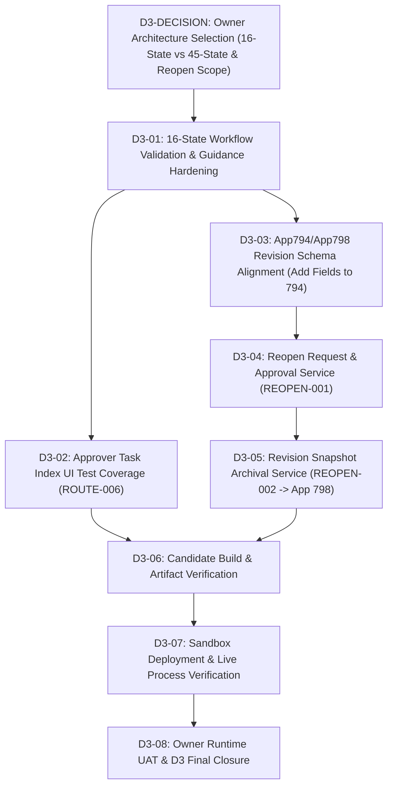

# D3-PRE1: Workflow / Reopen Scope & Readiness Gap Review

Date: 2026-09-08 ICT
Work Package: `D3-PRE1`
Type: `EVIDENCE-ONLY / READ-ONLY ANALYSIS`
Branch: `ai/antigravity-wp002c`
Repository: `rebootob/MBO2026`
Authoritative Starting HEAD: `802e4ed47a9815ddd34fb5cc242b421825cb4e89`
Author: Antigravity Execution Plane
Review Target: Human Owner & ChatGPT Control Plane

---

## 1. Executive Summary & Readiness Verdict

### 1.1 Verdict
```text
D3_READINESS = OWNER_DECISION_REQUIRED
D3_CURRENT_STATUS = HOLD / NOT AUTHORIZED
D3_IMPLEMENTATION_AUTHORIZED = NO
```

Stage D3 cannot proceed directly to implementation because repository truth reveals a fundamental architectural fork between the **live, working 16-state Process Management model** and an **unimplemented 45-state conceptual specification**, combined with significant schema and code gaps for the Reopen/Revision feature set.

### 1.2 Summary of Findings
1. **16-State vs 45-State Fork**:
   - **Repository & Sandbox Truth**: App 794 (Live Revision 70) is configured with **16 states and 28 actions**. The codebase (`src/validation/validation-engine.js`, `src/services/routing-service.js`, `src/ui/status-guidance-ui.js`, `src/ui/approver-task-index-ui.js`) and baseline document (`project-docs/CONFIRMED_BASELINE/ROUTING_WORKFLOW.md`) are built entirely around this 16-state model.
   - **Conceptual Document Truth**: `project-docs/architecture-redesign/GENERIC_ROUTING_ARCHITECTURE.md` and `project-docs/BUSINESS_RULES.md` ยง8 propose a 45-state "generic twin-status" model (6 stages ร— 2 [ALL/ANY] ร— 3 sub-phases + Draft/Completed/HR). This was never implemented in code or deployed to App 794.
   - **Recommendation**: **Adopt Option A (Harden 16-state model)**. Migrating to 45 states would require tearing down and rebuilding App 794 Process Management, invalidating existing tests, and introducing massive complexity with zero proven business necessity.

2. **Workflow Engine Reality**:
   - Transitions are executed **natively by the Kintone Process Management UI**, not via programmatic REST API (`/k/v1/record/status.json`).
   - The client-side code (`src/main-mbo-app.js`) intercepts the native transition event (`app.record.detail.process.proceed`) and runs `ValidationEngine.validateWorkflowAction` and `ValidationEngine.validate`.
   - There is no custom button or script-driven status transition engine in `src/`. User guidance is provided by `StatusGuidanceUI` and `ApproverTaskIndexUI`.

3. **Reopen & Revision Reality**:
   - **App 798 (MBO Revision Archive)** exists in Sandbox with 15 schema fields defined in `config/schema-spec.js`.
   - **App 794 Schema Gap**: App 794 does **NOT** have revision counter fields (`Revision_Number`, `Objective_Revision`, `Evaluation_Revision`).
   - **Implementation Gap**: Zero service, UI, or test code exists in `src/` for Reopen requests, approvals, or snapshot archival to App 798.
   - **Security / Integrity Risk**: A naive reopen without strict server-side permissions and snapshot immutability allows unauthorized status regression and score tampering.

4. **D1/D2 Carryover Status**:
   - `OBJ-003` (Copy Previous Year Objectives): Implemented in `src/services/copy-previous.js` (6 passing unit tests). Non-blocking carryover.
   - `ROUTE-006` (Approver Task Index UI): Implemented in `src/ui/approver-task-index-ui.js` and wired in `src/main-mbo-app.js`. Lacks dedicated unit tests. Should be formally tested in D3.
   - `SCORE-005` & `SCORE-006`: Handled natively by Kintone CALC fields on App 794. Dedicated JS formula tests were intentionally deferred.

---

## 2. D3 Candidate Function Matrix & Source/Test/Deploy Status

From `project-docs/control/01_FUNCTION_COMPLETION_MATRIX.md` and repository inspection:

| Function ID | Name | Matrix Status | Source Reality | Test Reality | App794 Deployment Reality | Gap Type |
|---|---|---|---|---|---|---|
| `ROUTE-004` | Workflow action executions and state transitions | `DEFINED` | **Partial**: `src/main-mbo-app.js` listens to `app.record.detail.process.proceed` and invokes `ValidationEngine.validateWorkflowAction`. State transitions occur via native Kintone UI. | Covered indirectly in `tests/validation-engine.test.js` (action validation), but 0 end-to-end process transition tests. | Native 16-state Process Management configured in App 794 Rev 70. | Implementation & Verification Gap (no programmatic action execution; UI hook only) |
| `REOPEN-001` | Post-approval reopen request handler | `DEFINED` | **Zero source**: No handler, no service, no UI in `src/`. | **Zero tests**: 0 tests in `tests/`. | Not configured in App 794. | Pure Implementation Gap |
| `REOPEN-002` | Evaluation revision versioning guard | `DEFINED` | **Zero source**: No archival snapshot service, no revision bump logic. | **Zero tests**: 0 tests in `tests/`. | App 798 exists in Sandbox; App 794 lacks revision fields. | Schema Gap on App 794 + Implementation Gap |
| `ROUTE-006` *(Carryover)* | Approver Task Index UI | `IMPLEMENTED` | **Exists**: `src/ui/approver-task-index-ui.js` wired in `src/main-mbo-app.js`. | **Zero dedicated tests**: No unit tests in `tests/`. | Deployed live in Rev 70 JS bundle. | Test Gap |
| `OBJ-003` *(Carryover)* | Copy Previous Year Objectives | `TESTED` | **Exists**: `src/services/copy-previous.js`. | **6 unit tests**: `tests/copy-previous.test.js` PASS. | Deployed live in Rev 70 JS bundle. | Verification / Documentation Gap |

---

## 3. 16-State Production Model vs 45-State Generic Architecture Analysis

### 3.1 Architectural Conflict Breakdown

```text
+-------------------------------------------------------------------------------+
|                             ARCHITECTURAL FORK                                |
+-------------------------------------------------------------------------------+
| OPTION A: 16-State Production Model       | OPTION B: 45-State Generic Model  |
| (ROUTING_WORKFLOW.md / Rev 70 Live)       | (GENERIC_ROUTING_ARCHITECTURE.md)|
+-------------------------------------------+-----------------------------------+
| 16 Discrete States                        | 45 Combinatorial States           |
| 28 Specific Actions                       | 6 Generic Slots x ALL/ANY Pairs   |
| Deployed & Verified on App 794 Rev 70     | Never Deployed to Any App         |
| Supported by validation-engine.js         | No Supporting Code in src/        |
| Clear, Named Roles (M1, M2, HR, CEO)      | Abstract Slot Numbers (Step 1..6) |
| Low Complexity (2-3 WPs to complete)      | High Complexity (8-12 WPs overhaul|
+-------------------------------------------+-----------------------------------+
```

### 3.2 Detailed Comparison

1. **State Space**:
   - **16-State Model**:
     - `01 Draft Objective` -> `02 Pending First Approval` -> `03 Pending Second Approval` -> `04 Pending CEO Approval` -> `05 Objective Approved` -> `06 Mid-term Draft` -> `07 Pending Mid First Approval` -> `08 Mid-term Approved` -> `09 Final Self Draft` -> `10 Pending Final First Evaluation` -> `11 Pending Final Second Evaluation` -> `12 Pending Final CEO Evaluation` -> `13 Final Evaluation Approved` -> `14 Pending Employee Signoff` -> `15 Pending HR Confirmation` -> `16 Completed`.
     - 28 Actions with precise return/rejection paths (e.g., `Return to Employee`, `Return to First Appraiser`, `Reject Objective`).
   - **45-State Model**:
     - Generic 6-step pipeline where each step has dual states: `Step N - ALL` (all assignees in step must approve) and `Step N - ANY` (any single assignee can approve), repeated across 3 phases (Objective, Mid-term, Final) = 36 states + Draft, Return, Completed, HR states = ~45 states.
     - Designed as a theoretical multi-tenant or variable-hierarchy framework.

2. **Sandbox & Source Truth**:
   - `src/validation/validation-engine.js`:
     - Hardcoded around the 16-state model: checks `Routing_Topology` (`M1_ONLY`, `M1_G1`, `M2`, `TMG_EXEC`), validates actions `Submit to First Appraiser`, `Approve Objective (First)`, `Approve Objective (Second)`, `Approve Objective (CEO)`, `Return to Employee`, etc.
   - `src/services/routing-service.js`:
     - Resolves App 795 route into explicit roles: `First_Appraiser`, `Second_Appraiser`, `CEO`.
   - `App 794 Live Process Management`:
     - Exactly matches the 16-state model.

3. **Classification**:
   - This is a **DIRECT ARCHITECTURAL TENSION** between:
     - **As-Built / Live Reality** (16-State Model)
     - **Conceptual Future Redesign** (45-State Model)

4. **Recommendation**:
   - **CHOOSE OPTION A (16-State Model)**.
   - Reason: The 16-state model matches the actual business workflow of TTMET (Employee -> M1 -> M2/Director -> CEO -> Signoff -> HR). It is already deployed in App 794, verified by Owner in Sandbox, and supported by existing validation code.
   - Attempting to implement the 45-state model would require:
     - Rewriting App 794 Process Management schema via REST API or manual Kintone configuration.
     - Scrapping and rewriting `validation-engine.js`.
     - Invalidating all existing workflow UAT progress.

---

## 4. Workflow Action Execution Reality (UI Hooks vs Programmatic Transitions)

### 4.1 Current Repository Implementation
In `src/main-mbo-app.js`:
```javascript
kintone.events.on('app.record.detail.process.proceed', async (event) => {
  // 1. Intercept native Kintone Process Management action
  // 2. Validate current record and action using ValidationEngine
  // 3. Return event (allow transition) or set event.error (block transition)
});
```
- There is **NO programmatic status transition service** (e.g., `kintone.api('/k/v1/record/status.json', 'PUT', ...)`).
- All status transitions are triggered by the **user clicking the native Kintone Process Management buttons** at the top of the record detail view.
- When an action button is clicked, Kintone fires `app.record.detail.process.proceed`. The custom script runs synchronously/asynchronously to permit or deny the action.

### 4.2 Is Programmatic Action Execution Needed?
- **Native UI Sufficiency**: Native Kintone Process Management provides native assignees, native status history, and native button permission enforcement. Programmatic API updates from client-side JS introduce race conditions, API permission complications (normal employees cannot change status via REST API unless given process management rights), and bypass native history logging.
- **Architectural Decision**: Keep native Kintone Process Management as the execution engine. The role of `ROUTE-004` should be:
  1. Strict pre-condition validation before allowing the native action to proceed (scores filled, comments provided, signoff checked, valid topology).
  2. Rendering clear `StatusGuidanceUI` explaining who must act next and what button to press.
  3. Blocking unauthorized native actions with informative error banners.

---

## 5. Assignee & Approver Task Routing Reality

### 5.1 Route Resolution vs Assignee Assignment
- **`src/services/routing-service.js`**:
  - Fetches Route configuration from App 795 (`MBO Approval Routes`).
  - Resolves dynamic roles based on employee department and level:
    - Standard Route: M1 (`First_Appraiser`) -> M2 (`Second_Appraiser`) -> CEO.
    - Executive Route (`M1_ONLY`): M1 -> CEO (M2 skipped).
    - TMG Route: Handles specific TMG division approval paths.
    - Self-Appraiser elision: If employee is their own M1, escalates directly to M2.
- **Native Kintone Assignees**:
  - In App 794 Process Management, assignees can be mapped to field values (e.g., field `First_Appraiser`, field `Second_Appraiser`, field `CEO`).
  - When the record enters `02 Pending First Approval`, Kintone automatically assigns the user specified in the `First_Appraiser` field.
- **`src/services/mbo-approval-task-service.js`**:
  - Queries App 794 using:
    ```text
    Status in ("02 Pending First Approval", "03 Pending Second Approval", ...) and Assignee in (LOGINUSER())
    ```
  - This accurately discovers records where the logged-in user is currently the active Kintone assignee.
- **`src/ui/approver-task-index-ui.js`**:
  - Renders a "Pending Approval Tasks" summary panel on the App 794 index view for approvers.

---

## 6. Reopen & Revision Reality

### 6.1 Business Rule Contract
- Principle: **1 Employee + 1 Fiscal Year = 1 MBO Record**.
- When an MBO reaches `16 Completed` (or `05 Objective Approved`), reopening must **NOT** create a new record.
- It must update the existing record (`Same Record / New Revision`).
- Prior approved state must be archived into **App 798 (MBO Revision Archive)** for audit, compliance, and historical traceability.

### 6.2 Schema & Source State
1. **App 798 (Revision Archive)**:
   - Schema defined in `config/schema-spec.js` (lines 485โ€“540).
   - Fields: `Original_Record_ID`, `Fiscal_Year`, `Employee_ID`, `Revision_Number`, `Revision_Type` (`Objective` vs `Evaluation`), `Archived_Date`, `Archived_By`, `Objectives_Snapshot_JSON`, `Competencies_Snapshot_JSON`, `Score_Summary_JSON`, etc.
   - App 798 is deployed in Sandbox.
2. **App 794 (MBO Evaluation Record)**:
   - Lacks `Revision_Number`, `Objective_Revision`, `Evaluation_Revision` in its field list.
3. **Source Code**:
   - Zero lines of code in `src/` reference App 798 or perform revision archival.

### 6.3 Security, Concurrency & Data Integrity Risks
- **Unauthorized Reopen**: Regular employees must NEVER be able to reopen an approved/completed MBO. Reopen must be restricted to HR/Administrator or require multi-party approval.
- **Score Tampering**: When reopened, final scores must be locked or revision-tracked so past evaluations cannot be altered without audit logging.
- **Race Conditions**: Two users reopening simultaneously could cause duplicate archive records or out-of-order revision numbers.
- **Permission Boundaries**: Regular users lack REST API write permissions to App 798 (Revision Archive). Archival must either occur under an admin/HR session or via a dedicated webhook/proxy if triggered by non-admin users.

---

## 7. D1/D2 Carryover Function Status

| Carryover Function | Origin Stage | Current Status | Impact on D3 |
|---|---|---|---|
| `OBJ-003` (Copy Previous Year Objectives) | D1 | `TESTED` (`src/services/copy-previous.js`, 6 tests pass) | Utility for draft objective creation. Independent of approval workflow. Non-blocking. |
| `ROUTE-006` (Approver Task Index UI) | D1 | `IMPLEMENTED` (`src/ui/approver-task-index-ui.js`) | Directly enhances Approver UX in D3. Lacks automated unit tests. Should be tested in D3. |
| `SCORE-005` (Subtotal Weight Calculation) | D1 | `DEFINED` (Native Kintone CALC fields) | App 794 CALC fields handle weights natively. Deferred JS formula tests are non-blocking. |
| `SCORE-006` (Final Rating Calculation) | D1 | `DEFINED` (Native Kintone CALC fields) | App 794 CALC fields handle ratings natively. Deferred JS formula tests are non-blocking. |

---

## 8. Stale & Contradictory Repository Documentation Audit

| Document | Stale / Contradictory Content | Required Correction / Clarification |
|---|---|---|
| `project-docs/00_MASTER_JOBLIST.md` | Claims D1 is waiting for Owner UAT, references App 794 Rev 69, lists outdated active WPs. | Mark as **NON-CANONICAL / HISTORICAL**. Canonical authority is `control/00_MASTER_DELIVERY_CONTROL.md` and `AI_CONTROL_CENTER.md`. |
| `project-docs/BUSINESS_RULES.md` ยง8 | Contains detailed specifications for the 45-state twin-status model (`Step N - ALL`, `Step N - ANY`). | Annotate ยง8 as **CONCEPTUAL ARCHITECTURE ONLY**. Clarify that App 794 Live operates on the 16-State Baseline (`CONFIRMED_BASELINE/ROUTING_WORKFLOW.md`). |
| `project-docs/architecture-redesign/GENERIC_ROUTING_ARCHITECTURE.md` | Entire document describes the 45-state architecture. | Keep as historical design reference; explicitly mark as superseded for V1 by `CONFIRMED_BASELINE/ROUTING_WORKFLOW.md`. |
| `project-docs/control/01_FUNCTION_COMPLETION_MATRIX.md` | `ROUTE-004`, `REOPEN-001`, `REOPEN-002` marked `DEFINED` without noting the 16-state vs 45-state dependency. | Update notes in matrix during future control sync to reflect 16-state baseline. |

---

## 9. Security, Audit, and Compliance Analysis

1. **Process Permission Bypass Prevention**:
   - Client-side validation in `main-mbo-app.js` can be bypassed if users interact directly with Kintone REST APIs.
   - **Defense**: Native Kintone Process Management permissions in App 794 must restrict action visibility exclusively to the designated role (e.g., only First Appraiser can see `Approve Objective (First)`). Client-side validation serves as business rule enforcement (validating data completeness, scores, comments).
2. **Reopen Authorization & Audit**:
   - Reopen request must be recorded in an immutable audit log.
   - App 798 records must have permissions set to `View Only` for employees and approvers, with `Create/Edit` restricted to HR/Admin.
3. **Data Integrity During Reopen**:
   - Reopening an evaluation must not wipe historical comments or scores without archiving.
   - Snapshot payload must include full JSON representations of Objectives, Competencies, and Ratings at the exact moment of reopen.

---

## 10. Proposed D3 Work Package Breakdown

To deliver D3 safely, work should be broken down into tightly bounded, bite-sized packages:



### Work Package Specifications:
1. **`D3-DECISION` (Owner Authorization Gate)**:
   - Owner formally accepts Option A (16-state production model) and approves the Reopen/Revision scope.
2. **`D3-01` (Workflow Action Validation & Guidance Hardening)**:
   - Scope: Harden `ValidationEngine.validateWorkflowAction` in `src/validation/validation-engine.js` for all 28 actions.
   - Add comprehensive unit test suite covering all 16 states and 28 transitions.
   - Zero Kintone writes.
3. **`D3-02` (Approver Task Index Verification)**:
   - Scope: Add unit and integration tests for `src/ui/approver-task-index-ui.js` and `src/services/mbo-approval-task-service.js`.
4. **`D3-03` (App 794 / App 798 Schema Alignment)**:
   - Scope: Document and verify required fields on App 794 (`Revision_Number`, `Objective_Revision`, `Evaluation_Revision`).
   - If authorized, apply schema update to Sandbox App 794.
5. **`D3-04` (Reopen Request Handler - REOPEN-001)**:
   - Scope: Implement `src/services/reopen-service.js` and Reopen modal UI.
   - Restrict reopen request/approval to authorized roles.
6. **`D3-05` (Revision Archival Guard - REOPEN-002)**:
   - Scope: Implement snapshot creation and write to App 798 before status reset.
7. **`D3-06` (Candidate Build)**:
   - Scope: esbuild candidate bundle and verify blob hashes.
8. **`D3-07` (Sandbox Deployment & Smoke Test)**:
   - Scope: Deploy candidate to App 794 Sandbox and smoke test.
9. **`D3-08` (Owner UAT & D3 Closure)**:
   - Scope: Owner executes workflow and reopen test scenarios. Control Plane reviews and closes D3.

---

## 11. Out of Scope for D3

The following items are **STRICTLY FORBIDDEN** from being included in Stage D3:
1. **Stage D4 (Analytics, Reporting & Dashboarding)**.
2. **Stage D5 (Batch Processing, Automated Mass Notification / Reminders)**.
3. **Stage D6 (Global HR Operations, Master Sync Tools)**.
4. **Stage D7 (Production Cutover & Deployment to Production Kintone Space)**.
5. **Rewriting D1 Hybrid Identity Gate** (D1 is PASS / CLOSED / DURABLE).
6. **Modifying D2 Excel Templates or Generator** (D2 is PASS / CLOSED / DURABLE).
7. **Refactoring App 795 (Routes) or App 796 (Master) Data Models** unless explicitly mandated by Owner.
8. **Implementing the 45-State Generic Routing Engine** (unless Owner explicitly overrules this review).

---

## 12. Architectural Recommendations

1. **Lock the 16-State Model as Canonical Baseline**:
   - Reaffirm `project-docs/CONFIRMED_BASELINE/ROUTING_WORKFLOW.md` as the sole authority for App 794 workflow.
   - Treat `GENERIC_ROUTING_ARCHITECTURE.md` as an exploratory post-2026 design study.
2. **Rely on Native Kintone Process Management for State Transitions**:
   - Do not build a custom REST-based state transition engine in JavaScript.
   - Utilize Kintone native buttons for user transitions; use custom JavaScript exclusively for validation guards, guidance prompts, and blocking illegal transitions.
3. **Design Reopen as a Privileged, Guarded Operation**:
   - Reopen should be triggered only from `05 Objective Approved` (returning to `01 Draft Objective`) or `16 Completed` (returning to `09 Final Self Draft` or `14 Pending Employee Signoff`).
   - Archival to App 798 must be synchronous and verified before resetting record status.

---

## 13. Concrete Verification & Test Strategy for D3

1. **Unit Test Coverage**:
   - Create `tests/workflow-transitions.test.js`: Test every action in each of the 16 states against valid and invalid field values (scores, comments, signatures).
   - Create `tests/reopen-service.test.js`: Test permission checks, snapshot generation, revision counter increments, and status rollbacks.
   - Create `tests/approver-task-index.test.js`: Test pending task discovery and card rendering.
2. **Sandbox Integration Testing**:
   - Step through a complete MBO lifecycle from `01 Draft Objective` to `16 Completed` using dedicated test users (Employee, M1 Appraiser, M2 Appraiser, CEO, HR).
   - Test Reopen from `05 Objective Approved` -> verify App 798 snapshot.
   - Test Reopen from `16 Completed` -> verify App 798 snapshot.
   - Verify negative cases: Employee trying to approve own record, skipping mandatory fields, unauthorized reopen attempt.

---

## 14. Evidence Citations & Repository Truth Mapping

- **App 794 Live Revision**: `70` (verified via Kintone API and Sandbox deploy evidence).
- **Live JS Blob**: `204d34db9e2eab297409a6a3d5e7f29c649779d5` (`dist/mbo-employee-app.js`).
- **Live CSS Blob**: `0532c1c3ba3d72f9157c4ab0b1e6033ffae1eb61` (`dist/mbo-employee.css`).
- **16-State Baseline Workflow**: `project-docs/CONFIRMED_BASELINE/ROUTING_WORKFLOW.md`.
- **45-State Conceptual Model**: `project-docs/architecture-redesign/GENERIC_ROUTING_ARCHITECTURE.md` & `project-docs/BUSINESS_RULES.md` ยง8.
- **Workflow Validation Implementation**: `src/validation/validation-engine.js` (lines 142โ€“240).
- **Process Proceed Hook**: `src/main-mbo-app.js` (lines 350โ€“395).
- **Route Resolution Engine**: `src/services/routing-service.js`.
- **Approver Task Discovery**: `src/services/mbo-approval-task-service.js`.
- **Approver Task UI Component**: `src/ui/approver-task-index-ui.js`.
- **App 798 Schema Definition**: `config/schema-spec.js` (lines 485โ€“540).
- **D1 Final Closure Decision**: `project-docs/D1_FINAL_CLOSURE_CONTROL_PLANE_DECISION.md` (commit `ccb685bf6d7f13f156a02c0a9496f56ecdb98a3d`).

---

## 15. Decision Matrix for Control Plane & Owner

| Decision Point | Option A (Recommended) | Option B (Alternative) | Risk / Tradeoff |
|---|---|---|---|
| **1. Workflow State Model** | **Harden 16-State Model** (`ROUTING_WORKFLOW.md`): Use existing App 794 Rev 70 live process management. | **Migrate to 45-State Model** (`GENERIC_ROUTING_ARCHITECTURE.md`): Redesign Process Management on App 794. | Option A has minimal risk, 100% test compatibility, and immediate readiness. Option B causes massive delays, high risk of regression, and complete schema rebuild. |
| **2. Workflow Action Execution** | **Native UI + JS Pre-validation**: Use native Kintone action buttons; validate in `process.proceed`. | **Programmatic REST Execution**: Build custom action buttons that call `/k/v1/record/status.json`. | Native UI is fully supported by Kintone ACLs, audit logs, and notification system. Custom buttons require elevated user permissions and risk race conditions. |
| **3. Reopen Architecture** | **Same Record / New Revision + App 798 Archive**: Retain single record per employee/FY; archive full snapshot in App 798. | **New Cloned Record**: Create a brand new record for the revision. | Cloned record violates single-record-per-FY integrity, breaks historical links, and complicates export. Same record is clean and preserves identity. |
| **4. D3 Scope Boundary** | **Bounded Core Workflow + Reopen (WPs D3-01 to D3-08)**. | **Expanded Scope** (include D4/D5 or batch approval). | Expanded scope violates project safety rules and risks destabilizing Stage D1/D2 gains. |

---

### Conclusion & Next Step
Stage D3 is **NOT READY** for immediate code execution until the Human Owner and ChatGPT Control Plane make the binding decision on **Option A vs Option B** in Section 15.

The Antigravity Execution Plane recommends **Option A**.

Upon Owner approval of Option A, the next work package should be **`D3-01` (Workflow Action Validation & Guidance Hardening)**.
