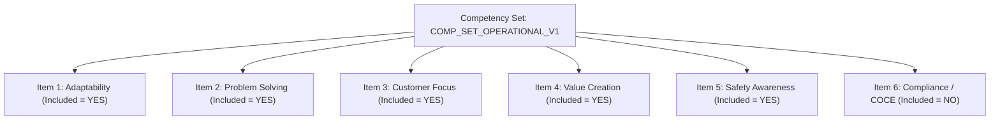

# Competency Architecture & COCE Governance Blueprint

> **Document Status:** Complete (Ready for User Freeze Review)  
> **COCE Governance:** `Evaluated = YES`, `Included_In_Score = NO`  
> **Last Updated:** 2026-08-24  

---

## 1. Competency Set Data Model

To eliminate hardcoded item numbers (e.g. `dropdown_choice6_1`), competencies are organized into **Competency Sets** comprising structured **Competency Items**:

---

## 2. Master Competency Inventory

### Set A: Operational Competency Set (`COMP_SET_OPERATIONAL_V1`)
*Used by: Staff, Chief, Japanese Staff*

| Seq | Competency Code | Name (TH / EN) | Rating Scale | Included In Score | Required |
| :---: | :--- | :--- | :---: | :---: | :---: |
| 1 | `COMP_ADAPT` | การปรับตัว / Adaptability | 1 - 5 | **YES** | YES |
| 2 | `COMP_PROB` | การแก้ไขปัญหา / Problem Solving | 1 - 5 | **YES** | YES |
| 3 | `COMP_CUST` | การมุ่งเน้นลูกค้า / Customer Focus | 1 - 5 | **YES** | YES |
| 4 | `COMP_VALUE` | การสร้างคุณค่าและความคิดริเริ่ม / Value Creation | 1 - 5 | **YES** | YES |
| 5 | `COMP_SAFETY`| ความตระหนักด้านความปลอดภัย / Safety Awareness | 1 - 5 | **YES** | YES |
| 6 | `COMP_COCE` | จรรยาบรรณและการปฏิบัติตามกฎ / Compliance (COCE) | 1 - 5 | **NO (Excluded)** | **YES** |

### Set B: Management & Executive Competency Set (`COMP_SET_MANAGEMENT_V1`)
*Used by: Assistant Manager, Section Manager, Senior Manager, DGM, GM, VP*

| Seq | Competency Code | Name (TH / EN) | Rating Scale | Included In Score | Required |
| :---: | :--- | :--- | :---: | :---: | :---: |
| 1 | `COMP_ADAPT` | การปรับตัว / Adaptability | 1 - 5 | **YES** | YES |
| 2 | `COMP_PROB` | การแก้ไขปัญหา / Problem Solving | 1 - 5 | **YES** | YES |
| 3 | `COMP_CUST` | การมุ่งเน้นลูกค้า / Customer Focus | 1 - 5 | **YES** | YES |
| 4 | `COMP_VALUE` | การสร้างคุณค่าและความคิดริเริ่ม / Value Creation | 1 - 5 | **YES** | YES |
| 5 | `COMP_SAFETY`| ความตระหนักด้านความปลอดภัย / Safety Awareness | 1 - 5 | **YES** | YES |
| 6 | `COMP_COCE` | จรรยาบรรณและการปฏิบัติตามกฎ / Compliance (COCE) | 1 - 5 | **NO (Excluded)** | **YES** |
| 7 | `COMP_LEAD` | ภาวะผู้นำและการบริหารคน / Leadership & People Mgmt | 1 - 5 | **YES** | YES |
| 8 | `COMP_STRAT`| การวางแผนกลยุทธ์และการสอนงาน / Strategy & Coaching | 1 - 5 | **YES** | YES |

---

## 3. Strict COCE Exclusion Rule
* **UI & Evaluation:** Must be displayed on screen and evaluated by appraisers (ratings 1-5 and qualitative comments required).
* **Scoring Denominator:** Automatically filtered out of mathematical calculations:
  $$\text{Part B Scoring Items} = \{ c \in \text{CompetencySet} \mid c.\text{Included\_In\_Score} = \text{YES} \}$$
