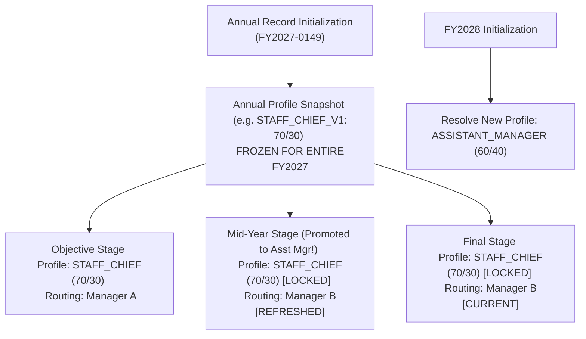

# Evaluation Profile Architecture Blueprint (ANNUAL PROFILE FREEZE)

> **Document Status:** Complete (Ready for Final Freeze Review)  
> **Core Policy:** **`ANNUAL_PROFILE_FREEZE = CONFIRMED`** (Profile locked for entire Fiscal Year)  
> **Governance Rules:** `DEC-035 (SCORING_SOURCE_OF_TRUTH = LIVE_KINTONE_FIRST)`, `DEC-036 (APPRAISER_WEIGHT_AND_COMPLETENESS_GOVERNANCE)`  
> **Mid-Year Position Change Policy:** Promotion/Transfer during FY retains Annual Profile Snapshot; new Profile applies in Next FY  
> **Last Updated:** 2026-08-24  

---

## 1. Executive Summary & The Four Core Snapshot Dimensions

To ensure absolute scoring stability, equity, and audit integrity, MBO V2 enforces the **Four Distinct Snapshot Dimensions**:

1. **PROFILE (Annual Snapshot):** Resolved strictly at Annual MBO Record initialization. Governs evaluation weights (70/30, 60/40, or 50/50), competency sets, rating scales, and scoring schemes. **FROZEN FOR THE ENTIRE FISCAL YEAR**.
2. **ROUTING (Stage Snapshot):** Resolved per evaluation stage (`OBJECTIVE`, `MID_YEAR`, `FINAL`). Approvers can change mid-year via Controlled Stage Refresh or In-Flight Reassignment without altering scoring criteria.
3. **HOSHIN (Versioned Business Snapshot):** Snapshot of Department and Section Hoshins at submission gate.
4. **REVISION (Business Revision State):** Controlled reopens maintain same `Record_Key` (`FY2027-0149`) with stage revision increment (`Objective_Revision: 2`).

---

## 2. Mid-Year Promotion & Transfer Governance

* **Annual Scoring Standard:** An employee is evaluated under a single, consistent scoring standard throughout the fiscal year.
* **Mid-Year Promotion:** If an employee is promoted from Chief (70/30) to Assistant Manager (60/40) mid-year, the current fiscal year **strictly retains the initial 70/30 Profile Snapshot**. The new 60/40 Assistant Manager Profile takes effect in the subsequent Fiscal Year (`FY2028`).
* **Superseded Design Notice:** The previously explored *Controlled Stage Profile Refresh* is **SUPERSEDED BY DEC-024: DO NOT IMPLEMENT**. Profile changes mid-year are strictly prohibited under standard operations.

---

## 3. Evaluation Profile Master Catalog Baseline (DEC-035, DEC-036)

| Profile Code | Target Positions / Groups | Part A Weight | Part B Weight | Competency Set Code | Scoring Appraisers ($K_{\text{expected}}$) | Appraiser Weight Layer | Part A Scoring Mode |
| :--- | :--- | :---: | :---: | :--- | :---: | :---: | :--- |
| `PROFILE_STAFF_CHIEF` | Staff, Senior Staff, Chief | **70%** | **30%** | `COMP_SET_OPERATIONAL` (5 + COCE) | 2 Appraisers | 50% / 50% | `DIFFICULTY_ACHIEVEMENT_MATRIX` |
| `PROFILE_JAPANESE_STAFF`| Japanese Expatriate Staff | **70%** | **30%** | `COMP_SET_OPERATIONAL` (5 + COCE) | 2 Appraisers | 50% / 50% | `DIFFICULTY_ACHIEVEMENT_MATRIX` |
| `PROFILE_MANAGEMENT` | Assistant Manager | **60%** | **40%** | `COMP_SET_MANAGEMENT` (7 + COCE) | 2 Appraisers | 50% / 50% | `DIFFICULTY_ACHIEVEMENT_MATRIX` |
| `PROFILE_MANAGEMENT` | Section Mgr, Senior Mgr, DGM | **50%** | **50%** | `COMP_SET_MANAGEMENT` (7 + COCE) | 2 Appraisers | 50% / 50% | `DIFFICULTY_ACHIEVEMENT_MATRIX` |
| `PROFILE_EXECUTIVE` | General Manager (GM), Vice President (VP) | **50%** | **50%** | `COMP_SET_MANAGEMENT` (7 + COCE) | **1 Appraiser** (Baseline; Capacity: 1..2) | 100% | `ACHIEVEMENT_DIRECT` |
