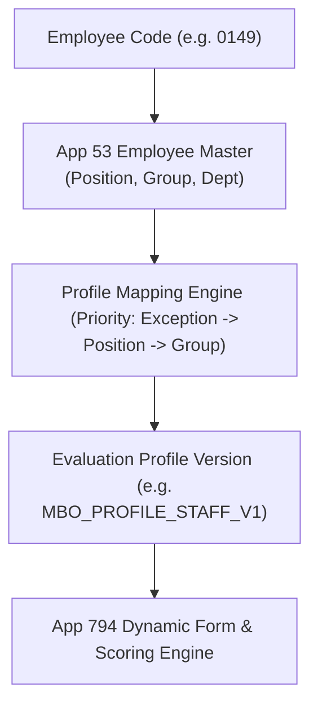

# Evaluation Profile Architecture Blueprint

> **Document Status:** Complete (Ready for User Freeze Review)  
> **Core Concept:** Configuration-Driven Evaluation Profile Resolution & Governance  
> **Last Updated:** 2026-08-24  

---

## 1. Executive Summary

In legacy PMS, 8 separate apps were maintained with hardcoded formulas and duplicated schemas. MBO V2 unifies all employee evaluation groups into a **single long-lived application core (App 794)** governed by the **Evaluation Profile Master Architecture**.

An employee's evaluation parameters (Part A/B weights, Competency Set, Rating Scale, Appraiser Model, and Objective limits) are dynamically resolved at runtime from configuration rather than hardcoded in JavaScript.

---

## 2. Evaluation Profile Master Schema Concept

| Attribute Code | Data Type | Business Description | Example Value |
| :--- | :--- | :--- | :--- |
| `Profile_Code` | SINGLE_LINE_TEXT | Unique Business Identifier | `PROFILE_STAFF_CHIEF` |
| `Profile_Version` | NUMBER | Monotonically increasing version | `1` |
| `Profile_Name_TH` | SINGLE_LINE_TEXT | Thai Display Name | `กลุ่มพนักงานและหัวหน้างาน (Staff & Chief)` |
| `Profile_Name_EN` | SINGLE_LINE_TEXT | English Display Name | `Staff & Chief Evaluation Profile` |
| `Effective_From` | DATE | Validity Start Date | `2026-04-01` |
| `Effective_To` | DATE | Validity End Date (Optional) | `2099-03-31` |
| `Part_A_Weight` | NUMBER | Percentage weight for Objectives | `70` (or `50` for Mgr) |
| `Part_B_Weight` | NUMBER | Percentage weight for Competencies | `30` (or `50` for Mgr) |
| `Objective_Min` | NUMBER | Minimum required objectives | `2` |
| `Objective_Max` | NUMBER | Maximum allowable objectives | `10` |
| `Objective_Default`| NUMBER | Default rows displayed | `3` |
| `Competency_Set_Code`| SINGLE_LINE_TEXT | Assigned Competency Set | `COMP_SET_OPERATIONAL_V1` |
| `Scoring_Scheme_Code`| SINGLE_LINE_TEXT | Assigned Scoring Calculation | `SCHEME_STANDARD_70_30` |
| `Appraiser_Model`| DROP_DOWN | Evaluator count model | `TWO_APPRAISERS` / `ONE_APPRAISER` |
| `Export_Template_Code`| SINGLE_LINE_TEXT | Excel Export layout identifier | `EXPORT_STAFF_V1` |

---

## 3. Evaluation Profile Master Catalog (8 Core Groups -> 4 Profile Families)

| Profile Code | Target Positions / Groups | Part A Weight | Part B Weight | Competency Set Code | Scoring Appraisers |
| :--- | :--- | :---: | :---: | :--- | :---: |
| `PROFILE_STAFF_CHIEF` | Staff, Senior Staff, Chief | **70%** | **30%** | `COMP_SET_OPERATIONAL` (5 + COCE) | 2 Appraisers |
| `PROFILE_JAPANESE_STAFF`| Japanese Expatriate Staff | **70%** | **30%** | `COMP_SET_OPERATIONAL` (5 + COCE) | 2 Appraisers |
| `PROFILE_MANAGEMENT` | Asst Mgr, Section Mgr, Senior Mgr, DGM | **50%** | **50%** | `COMP_SET_MANAGEMENT` (7 + COCE) | 2 Appraisers |
| `PROFILE_EXECUTIVE` | General Manager (GM), Vice President (VP) | **50%** | **50%** | `COMP_SET_EXECUTIVE` (7 + COCE) | 1-2 Appraisers |
