# Generic Approval Routing Architecture Blueprint (Twin-Status Engine & In-Flight Reassignment)

> **Document Status:** Complete (Updated with In-Flight Approver Reassignment Governance)  
> **Core Architecture:** Twin-Status Execution Engine (`Step N - ALL` / `Step N - ANY`) via Server-Side `filterCond`  
> **Slot Capacity:** `GENERIC_APPROVAL_SLOT_CAPACITY = 6` + Dedicated `HR_FINAL_CHECK` (45 Total Native Statuses)  
> **Reassignment Governance:** Strict separation of Controlled Stage Refresh vs. In-Flight Single-Record Reassignment  
> **Last Updated:** 2026-08-24  

---

## 1. The Two Route Modification Operational Modes

MBO V2 strictly isolates route changes into two distinct operational paradigms:

```mermaid
graph TD
    subgraph Mode_A [Mode A: Controlled Stage Route Refresh]
        A_TRIGGER["New Evaluation Stage Start <br/> (e.g. Before Mid-Year / Final)"] --> A_RESOLVE["Re-resolve from Routing Master (App 795)"]
        A_RESOLVE --> A_SNAP["Create New Stage Snapshot for Upcoming Stage"]
        A_SNAP --> A_LOG["Log Stage Route Refresh Audit"]
    end

    subgraph Mode_B [Mode B: In-Flight Approver Reassignment]
        B_TRIGGER["Current Stage In-Progress & Approver Unavailable <br/> (Resignation / Transfer / Leave / Inactive)"] --> B_ACTION["HR Reassignment Modal: Select New Approver & Reason"]
        B_ACTION --> B_NATIVE["Call Native Kintone REST API: Update Assignees"]
        B_NATIVE --> B_REC["Update Current Effective Approver on Current Record Only"]
        B_REC --> B_AUDIT["Append Immutable Audit Event: APPROVER_REASSIGNED"]
    end
```

---

## 2. In-Flight Approver Reassignment Principles

1. **Completed Stages Are Strictly Immutable:** If Objective Setting was approved by `Manager A`, historical audit permanently reflects `Manager A`. Subsequent reassignments in Mid-Year or Final will NEVER rewrite historical approver stamps or comments.
2. **Current Record Only Default:** In-flight reassignment applies strictly to the single active transaction record. It **does NOT silently modify App 795 Routing Master** or alter other employees' routing.
3. **Native Kintone API Integration:** Reassignment updates active assignees server-side via Kintone's Native REST API (`/k/v1/record/assignees.json`), guaranteeing that action buttons are strictly restricted to the newly authorized approver.
4. **ALL / ANY Rule Governance:**
   - **`ALL` Rule with Multiple Approvers ($[A, B, C]$):** If $B$ resigns and is replaced by $D$, the slot becomes $[A, D, C]$. If $A$ already approved, $A$'s completed approval is preserved, $D$ receives the pending assignment, and $C$ remains pending.
   - **`ANY` Rule:** Reassignment is permitted before any approver acts. Once an approval completes the step, reassignment is blocked.
5. **Reassignment Block Conditions:**
   - Blocked if stage is already completed or record is closed/archived.
   - Blocked if target user is inactive/disabled or unauthorized.

---

## 3. Standardized Slot Capacity (6 Slots + Dedicated HR)

* **Architectural Standard:** **`GENERIC_APPROVAL_SLOT_CAPACITY = 6`**.
* **HR Final Check:** Dedicated Stage (`HR_FINAL_CHECK`) following business approval in Final Evaluation.
* **Grand Total:** **45 Native Process Statuses** across the entire lifecycle.
