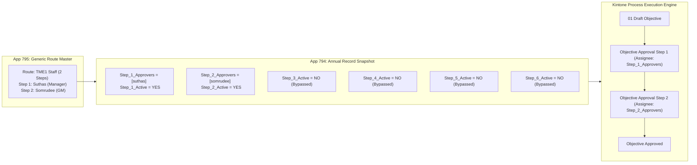

# Generic Approval Routing Architecture Blueprint

> **Document Status:** Complete (Ready for Freeze Review)  
> **Core Model:** Slot-Based Generic Execution Engine (Decoupled Configuration & Native Execution)  
> **Capacity:** 6 Generic Approval Slots + 1 HR Final Check Slot (Total 7 Steps)  
> **Last Updated:** 2026-08-24  

---

## 1. Executive Summary & The Slot Execution Engine

To eliminate the legacy state explosion (384 actions) while respecting Kintone's static Process Management engine, MBO V2 implements the **Slot-Based Generic Execution Engine**:

* **Business Route Master (App 795):** Stores dynamic, ordered approval steps per Section/Profile (e.g. 1 to 6 steps).
* **Native Process Management (App 794):** Configured with **6 Generic Approval Slots** per evaluation stage (`Slot 1` through `Slot 6`) plus `HR Final Check`.
* **Dynamic Slot Binding:** When an employee record is created/opened, the resolved Business Route dynamically binds approvers to `Step_1_Approvers`, `Step_2_Approvers`, ..., `Step_N_Approvers`. Unused slots (e.g. Slots 3-6 in a 2-step route) are automatically bypassed seamlessly.

---

## 2. Maximum Routing Capacity Calculation

* **Legacy Maximum Observed:** 5 Approval Steps + HR Check (App 307 / Combined Staff-Exec Chain).
* **Minimum Required Capacity:** 5 Steps.
* **MBO V2 Standard Architecture Capacity:** **6 Generic Approval Slots + 1 HR Final Check Slot**.
* **Future Reserve:** 100% covers all existing company positions (Staff, Chief, Japanese Staff, Section Mgr, Dept Mgr, GM, VP, President) with an extra slot for emerging mentor/trainee roles.

---

## 3. Sequence vs. ANY / ALL Semantics

* **Sequence (Level / Step):** Represents strict sequential progression (Step 1 -> Step 2 -> Step 3).
* **Rule (Within Step):**
  - **`ALL` (Default):** All assigned approvers in the slot must approve before the workflow advances to the next step.
  - **`ANY`:** Any single approver in the slot approving will advance the workflow.
* *Standard:* Default rule is always **`ALL`**.

---

## 4. Generic Return / Reject Semantics

* **Step-by-Step Return:** An approver at `Step N` can return the record to `Step N-1` (Previous Step) or directly to `01 Draft Objective` (Employee Revision).
* **Clear Action Labels:** Actions are standard across all profiles: `Approve`, `Return to Previous Step`, `Return to Employee Draft`.

---

## 5. Annual Route Snapshot & Current FY Supremacy

* **Immutable Transaction Snapshot:** When an annual MBO record is created in App 794, the resolved route is snapshotted into `Snapshot_Step_1_Approvers` ... `Snapshot_Step_6_Approvers`.
* **Current FY Supremacy:** Historical records (FY2026) permanently retain their snapshot. When FY2027 opens, the route is freshly resolved from App 795. Annual Plan Carry Forward **never carries forward routing snapshots**.
