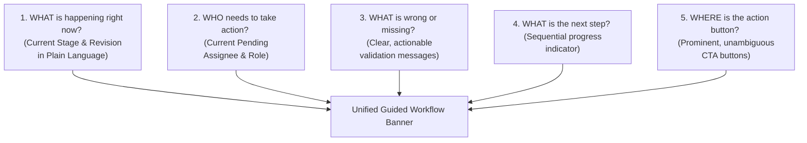

# Guided Workflow UX Architecture Blueprint (FROZEN CORE)

> **Document Status:** Complete (Required Core Subsystem)  
> **Design Philosophy:** Zero-Confusion Guided Interaction ("What, Who, Why, Next, Where")  
> **Target Audiences:** Employees, Managers, GMs, HR Administrators  
> **Last Updated:** 2026-08-24  

---

## 1. The 5 Core Principles of Guided UX

To eliminate user confusion across 45 native Kintone statuses and complex multi-stage approvals, the custom UI layer implements the **Guided Interaction Framework**:

---

## 2. Component Specifications

### Component A: Unified Stage Progress Banner (Top of Form)
* **Visual Stepper:** `1. Objective Setting` -> `2. Mid-Year Review` -> `3. Final Evaluation` -> `4. HR Final Check` -> `5. Completed`.
* **Active Status Card:**
  * **Plain Text Status:** e.g. "รอการอนุมัติเป้าหมายจาก ผู้จัดการส่วน (Waiting for Section Manager Approval)" instead of technical code `02 Manager L1 Pending - ALL`.
  * **Current Actor:** Displays photo/name of the specific assigned approver.
  * **Revision Pill:** Displays `Revision 1` or `Revision 2 (Reopened)`.

### Component B: Dynamic Action Bar (Bottom / Sticky Header)
* **Context-Aware CTA:**
  * If Employee in Draft: **[บันทึกแบบร่าง (Save Draft)]** | **[ส่งเป้าหมายเพื่อขออนุมัติ (Submit Objectives)]**
  * If Approver: **[อนุมัติ (Approve)]** | **[ส่งกลับแก้ไข (Return for Correction)]**
  * If HR Admin: **[Controlled Reopen]** | **[Reassign Approver]** | **[HR Final Check Complete]**
* **Validation Guard:** Action buttons are disabled with explanatory tooltips if submission gates (e.g. Total Weight != 100% or Hoshin Not Ready) are unmet.

### Component C: Bilingual Localization (TH / EN)
* Dynamic language toggle (Thai / English) with 100% coverage across field labels, validation messages, and guided tooltips.
