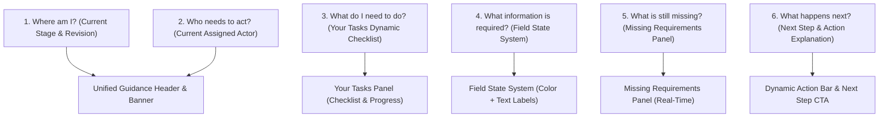

# Guided Workflow UX Architecture Blueprint (CORE GOVERNANCE)

> **Document Status:** Complete (Ready for Freeze Review)  
> **Core Governance:** Every page must clearly explain Current State, Required Action, Missing Items, and Next Step  
> **Target Audiences:** Employees, Managers, GMs, VPs, President, HR Administrators  
> **Last Updated:** 2026-08-24  

---

## 1. The 6 Core Guided Interaction Questions

Every user-facing screen in MBO V2 must instantly and unambiguously answer 6 essential questions for the user without requiring knowledge of internal Kintone process technicalities:

---

## 2. Mandatory Guidance UI Components

### Component 1: Required Guidance Header
Fixed at the top of every MBO Record:
* **Fiscal Year:** e.g. `FY2027 (1 Apr 2027 - 31 Mar 2028)`
* **Current Stage:** `Objective Setting` | `Mid-Year Review` | `Final Evaluation` | `HR Final Check` | `Completed`
* **Business Status (Plain Language):** e.g. "รอหัวหน้าตรวจสอบ / Waiting for Manager Review" *(Zero technical codes like `02_OBJ_STEP1_ALL`)*
* **Current Revision:** `Revision 1` or `Revision 2 (Reopened)`
* **Current Actor / Waiting For:** e.g. `Manager A (Section Manager)`
* **Next Business Step:** e.g. `GM Approval`

### Component 2: Stage & Approval Progress Trackers
* **Stage Progress Stepper:** High-level timeline showing 5 overall stages with clear completion icons.
* **Approval Progress Tracker:** Dynamically rendered from the current **Stage Route Snapshot** (e.g. Employee -> Manager L1 -> GM), indicating active, waiting, and skipped steps.

### Component 3: "When User Has No Action" State
When a record is opened by an actor whose turn has not arrived:
* Prominent banner: **"ยังไม่ต้องดำเนินการ / No action required from you"**
* Explanatory text: "ขณะนี้คำร้องกำลังรอการตรวจสอบจาก Manager A ข้อมูลถูกล็อกชั่วคราว / Currently waiting for Manager A. Record is locked."

### Component 4: Your Tasks Panel (Dynamic Checklist)
When it is the user's turn to act:
* Real-time reactive checklist (e.g. `5 / 8 Completed`).
* Checklist items auto-check as the user inputs valid data without requiring full page refresh.

### Component 5: Field State Design (Double Encoding: Color + Text)
To guarantee 100% accessibility:
* **Editable:** Green border + `[กรอกได้ / Editable]`
* **Locked:** Gray background + `[ระบบล็อก / Locked]`
* **System Data:** Blue background + `[ข้อมูลจากระบบ / System Data]`
* **Required:** Yellow background + `[ต้องกรอก / Required]`
* **Invalid:** Red border + `[ข้อมูลไม่ถูกต้อง / Invalid]`

### Component 6: Contextual Subsystem Guidance
* **Return for Correction:** Displays returning approver name, return reason, list of fields to fix, and direct anchor links.
* **Reopen Revision:** Displays revision counter, reopen reason, and highlights which subsequent approvals are invalidated and require re-approval.
* **Hoshin Not Ready Gate:** Displays exact status of Department and Section Hoshins with clear warning that Save Draft is allowed but Submit Objective is blocked.
* **Routing / Profile Missing Errors:** Replaces cryptic technical errors with human-friendly notices explaining that HR is actively setting up their routing or profile.

---

## 3. Confidentiality & Security Boundaries in Guidance
* The Guidance Engine never leaks confidential appraisal data (e.g. Manager/GM internal scores or comments) to employees.
* If internal steps are in progress, employees see a generalized business status: "กำลังอยู่ระหว่างการประเมินผล / Evaluation review in progress".
