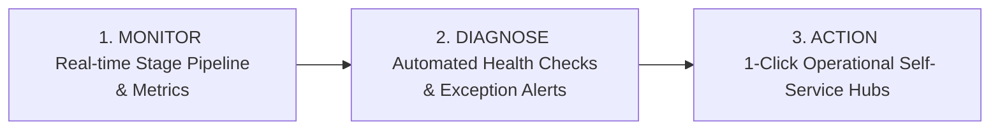

# HR Control Center & Operations Architecture Blueprint (FROZEN)

> **Document Status:** **`HR_CONTROL_CENTER_ARCHITECTURE = FROZEN`**  
> **Core Objective:** Single-Pane-of-Glass Monitoring, Diagnosis, & Direct Self-Service Action (>= 95% IT Independence)  
> **Governance:** Actionable Monitoring, Guided Workflow UX, Native Security Boundaries  
> **Last Updated:** 2026-08-24  

---

## 1. Executive Summary: Monitor -> Diagnose -> Action

The **HR Control Center (HRCC)** is an interactive operational management cockpit for HR administrators that combines real-time pipeline monitoring, automated exception diagnosis, and direct self-service remediation:

---

## 2. Core Operational Modules

### Module 1: Overview Dashboard & Exception Alerts (Need Attention)
* **Real-time Pipeline:** `Not Started` -> `Draft` -> `Waiting Manager L1` -> `Waiting Manager L2` -> `Waiting GM/VP` -> `Objective Approved` -> `Mid-Year` -> `Final` -> `HR Final Check` -> `Completed`.
* **Need Attention Aggregator:** Automatically groups exceptions:
  * `Routing Not Configured` -> Direct link to Configure Routing
  * `Profile Not Configured` -> Direct link to Configure Profile
  * `Hoshin Not Ready` -> Direct link to Manage Hoshin
  * `Inactive Approver on Pending Record` -> Direct link to Reassign Approver
  * `Approval Overdue (> 7 Days)` -> Direct link to Send Reminder
  * `Reopen Requested` -> Direct link to Review Reopen

### Module 2: Employee Evaluation Monitor (Actionable Grid)
* Rich interactive data grid with 1-click drill-down:
  * `Employee Code`, `Name`, `Department`, `Section`, `Profile`, `Stage`, `Status (Plain Language)`, `Waiting For (Role & Name)`, `Days Pending`, `Next Required Action`, `Revision`, `Alert / Health Badge`.

### Module 3: Self-Service Operations Hubs (>= 95% HR Autonomy)
* **Routing Operations Hub:** Future routing maintenance, Single in-flight reassignment, Bulk pending reassignment with Impact Preview.
* **Reopen & Revision Center:** Reopen request queue, Approval invalidation impact preview, Controlled Reopen execution.
* **Hoshin Management Hub:** Department and Section Hoshin readiness toggles (`Ready_For_MBO`), Version publication, Copy previous FY.
* **Annual Cycle Hub:** Japanese FY tracking (1 Apr - 31 Mar), New hire record onboarding, Annual closing lock.

---

## 3. Security & Native Permissions
* Access to HR Control Center is strictly governed by **Native Kintone Group/Role Permissions (`HR_ADMIN_GROUP`)**.
* System Administrators without business HR authorization cannot execute business actions.
