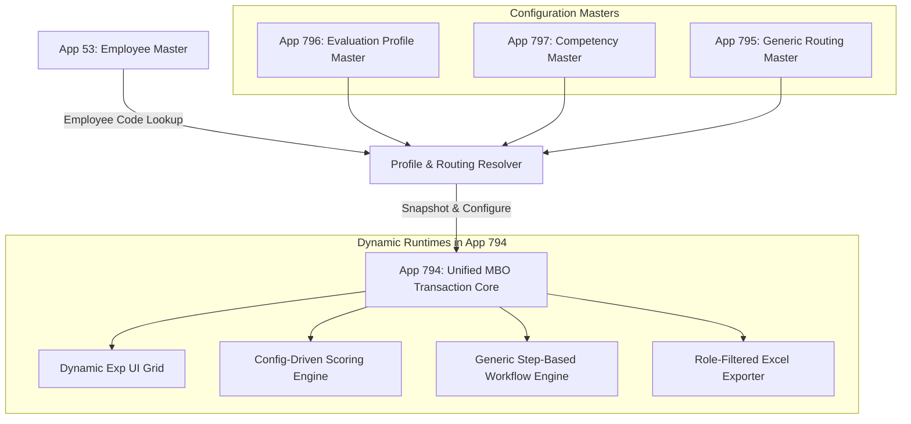

# MBO V2 Target Architecture Blueprint

> **Document Status:** Proposed (For User Review)  
> **Architecture Pattern:** Unified Transaction Core + Configuration-Driven Profiles  
> **Last Updated:** 2026-08-23  

---

## 1. High-Level Architectural Vision

Rather than maintaining 8 isolated, duplicate applications, MBO V2 consolidates all employee evaluations into a **Unified MBO Transaction Core** powered by 3 lightweight Master Apps:

---

## 2. Core Subsystems

1. **Evaluation Profile Master (App 796):** Defines weights (e.g. 70/30, 50/50), objective limits (2-10), and competency set assignment per corporate rank.
2. **Competency Master (App 797):** Centralizes all corporate and functional competencies, eliminating hardcoded competency text.
3. **Generic Routing Master (App 795 Refactor):** Replaces fixed Manager/GM columns with generic sequential steps (`Step_10`, `Step_20`, `Step_30`, `Step_40`) supporting any approval chain length (1 to 4 steps) and `ALL`/`ANY` rules.
4. **Unified MBO Transaction App (App 794):** Single transactional database storing all historical and active evaluations, with immutable snapshot versioning.
