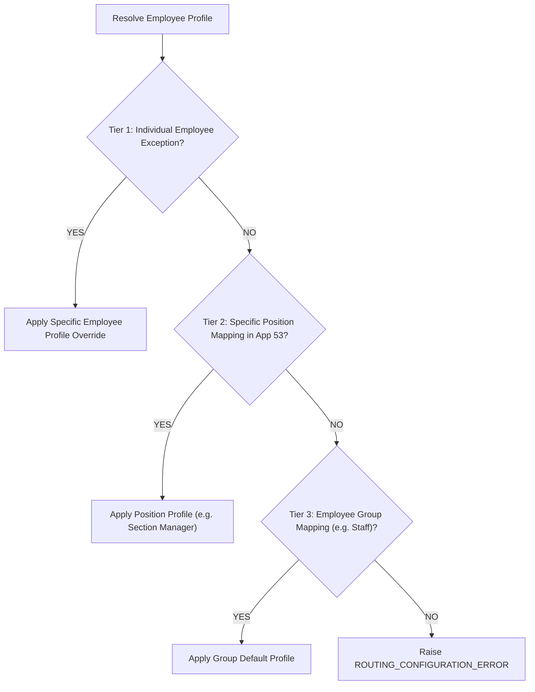

# Evaluation Profile Resolution Engine Blueprint

> **Document Status:** Complete  
> **Last Updated:** 2026-08-24  

---

## 1. Deterministic Priority Resolution Hierarchy

When an employee MBO record is initialized or refreshed, the Profile Resolution Engine executes a 3-tier deterministic lookup:

---

## 2. Resolution Output & Snapshot Binding
Upon successful resolution, the engine returns the exact `Profile_Code` and `Profile_Version`, which is immediately locked into App 794's immutable transaction snapshot fields.
