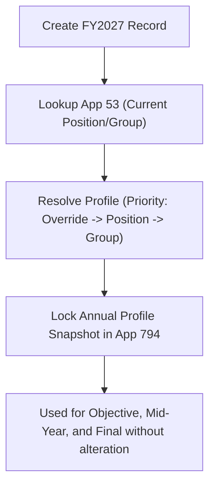

# Evaluation Profile Resolution Engine Blueprint (Annual Timing)

> **Document Status:** Complete (Annual Resolution Model)  
> **Resolution Timing:** Executed STRICTLY at Annual Record Initialization  
> **Last Updated:** 2026-08-24  

---

## 1. Resolution Timing & Lifetime Immutability

* **Timing:** The Profile Resolution Engine executes exclusively during **Annual MBO Record Creation**.
* **Immutability:** Once resolved, the `Snapshot_Profile_Code` and all associated scoring rules are permanently locked in App 794 for that entire Fiscal Year.
* **No Mid-Year Re-Resolution:** Opening Mid-Year or Final stages does NOT trigger Profile Resolution. (Routing resolution is handled separately per stage).

