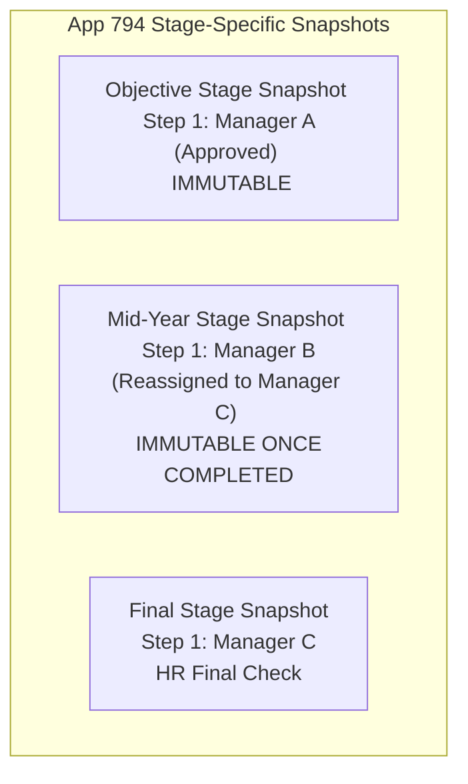

# Transaction Route Snapshot Schema in App 794 (FROZEN)

> **Architecture Status:** **`FROZEN`**  
> **Target App:** App 794 Transaction Core  
> **Model:** Stage-Specific Immutable Routing Snapshots (Objective, Mid-Year, Final)  
> **Capacity:** 6 Generic Slots + 1 HR Slot per Stage  
> **Last Updated:** 2026-08-24  

---

## 1. Stage-Specific Route Snapshot Architecture

To accommodate mid-year supervisor changes, transfers, and in-flight reassignments without altering historical evidence, App 794 stores independent snapshots per stage:

---

## 2. Field Schema per Generic Slot ($N \in [1..6]$)

| Slot Component | Objective Snapshot Field | Mid-Year Snapshot Field | Final Snapshot Field | Field Type |
| :--- | :--- | :--- | :--- | :--- |
| **Approvers** | `Obj_Step_N_Approvers` | `Mid_Step_N_Approvers` | `Fin_Step_N_Approvers` | `USER_SELECT` |
| **Effective Current** | `Obj_Step_N_Effective` | `Mid_Step_N_Effective` | `Fin_Step_N_Effective` | `USER_SELECT` |
| **Rule** | `Obj_Step_N_Rule` | `Mid_Step_N_Rule` | `Fin_Step_N_Rule` | `DROP_DOWN` (`ALL`/`ANY`) |
| **Active Flag** | `Obj_Step_N_Active` | `Mid_Step_N_Active` | `Fin_Step_N_Active` | `DROP_DOWN` (`YES`/`NO`) |
| **Role Label** | `Obj_Step_N_Role` | `Mid_Step_N_Role` | `Fin_Step_N_Role` | `SINGLE_LINE_TEXT` |

---

## 3. Dedicated HR Final Check Fields
* `HR_Final_Approvers`: `USER_SELECT`
* `HR_Final_Review_Date`: `DATETIME`
* `HR_Final_Status`: `DROP_DOWN` (`PENDING`, `VERIFIED`, `COMPLETED`)

---

## 4. Reassignment Audit Table (`Routing_Reassignment_Log`)
* `Record_Key`, `Fiscal_Year`, `Evaluation_Stage`, `Approval_Step`
* `Original_Approver`, `New_Approver`, `Reason`, `Reassigned_By`, `Reassigned_At`
