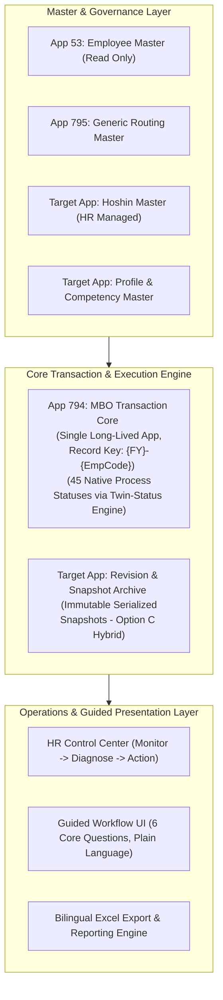

# MBO V2 Final Implementation Blueprint & Master Technical Specification

> **Document Status:** Complete (Phase 0 Implementation Baseline)  
> **Governance:** Strict 16-Phase Phased Delivery Model, No-Orphan Policy, 3-Mode Verification  
> **Source of Truth:** Consolidated Baseline of All Frozen Architectures (DEC-013 to DEC-027)  
> **Last Updated:** 2026-08-24  

---

## 1. Executive Architecture Overview

MBO V2 consolidates 8 legacy PMS applications into a single, long-lived, highly configurable enterprise system built on native Kintone foundations with custom JavaScript UX enhancements.

---

## 2. Final Target Application Registry

| App ID / Target | Application Name | System Role | Mode in V2 | Governing Architecture |
| :--- | :--- | :--- | :--- | :--- |
| **App 53** | Employee Master | Organization, Department, Section, Title | READ ONLY | Existing Corporate Master |
| **App 794** | MBO V2 Transaction Core | Primary Annual Evaluation Workflow Core | ACTIVE CORE | `DEC-013`, `DEC-019`, `DEC-022` |
| **App 795** | Generic Routing Master | 6-Slot Approval Chain Master | ACTIVE MASTER | `DEC-019`, `DEC-020`, `DEC-021` |
| **Hoshin App** | Annual Hoshin Master | HR-Managed Department & Section Hoshins | ACTIVE MASTER | `DEC-018` |
| **Archive App** | Revision Archive App | Immutable Serialized Historical Snapshots | ACTIVE ARCHIVE| `DEC-022` (Option C Hybrid) |
| **Profile App** | Profile & Scoring Master | Evaluation Profiles & Competency Catalog | ACTIVE MASTER | `DEC-023`, `DEC-024` |
| **Legacy Apps** | Apps 283, 305, 307, 310, 640, 643, 715, 716 | Historical Reference (FY2024-FY2025) | READ ONLY / RETIRED | `DEC-016` (No Orphan) |

---

## 3. The 16 Phased Delivery Roadmap

| Phase | Phase Name | Scope & Key Deliverables | Exit Test Gate |
| :---: | :--- | :--- | :--- |
| **P0** | **Final Blueprint** | Consolidated architecture specifications, change matrices, defect registers | Architecture Review |
| **P1** | **Safety & Test Harness** | Hard write lock, automated test framework, backup/rollback pipelines | 32/32 Unit Tests Pass |
| **P2** | **Annual Record Core** | App 794 base schema, `Record_Key` `{FY}-{EmpCode}`, App 53 lookup, Japanese FY | Key Generation Tests |
| **P3** | **Profile & Scoring Engine** | 4 Profile Families, `WEIGHTED_PART_A_B`, COCE Excluded Rule, Half-Up rounding | 30 Scoring Tests (`SC-001..30`)|
| **P4** | **Hoshin Governance Gate** | HR Hoshin Master, Dual-Level Gate (Dept+Sec), `Ready_For_MBO` gate | Hoshin Gate Block Tests |
| **P5** | **Generic Routing Engine** | App 795 flat master, Twin-Status (`ALL`/`ANY`), 6 Slots + HR Final Check (45 Statuses) | Topology Tests (`RT-001..20`) |
| **P6** | **In-Flight Reassignment** | 3 Change Scopes, REST API assignees, `APPROVER_REASSIGNED` audit, Bulk Preview | Reassign Tests (`RT-021..50`) |
| **P7** | **Controlled Reopen / Revision**| Same Record Key, Stage Revision counters, Option C Archive, Approval Invalidation | Reopen Tests (`RT-071..90`) |
| **P8** | **Guided Workflow UX** | 6 Core Questions, Progress Steppers, Double-Encoded Field States, Task Checklist | 25 UX Tests (`UX-001..25`) |
| **P9** | **HR Control Center** | Overview Dashboard, Employee Monitor Grid, Self-Service Hubs (>= 95% Autonomy) | HRCC Functional Tests |
| **P10**| **Carry Forward & History** | Whitelist planning copy from latest valid revision, Immutable historical read-only | Carry Forward Audit Tests |
| **P11**| **Export & Reporting** | Bilingual Excel export matching profile layouts, HR calibration summaries | Layout & Data Fidelity Tests|
| **P12**| **Security Hardening** | Native field/record permissions, confidential score hiding, shared account security | Vulnerability & Leak Tests |
| **P13**| **Migration & Cleanup** | 7-step retirement lifecycle, legacy script cleanup, zero dead artifacts | No-Orphan Audit (Count=0) |
| **P14**| **Integrated UAT** | End-to-end execution of all 125 defined test scenarios | 125/125 Scenarios PASS |
| **P15**| **Production Cutover** | Cutover checklist, baseline database snapshot, user manual publication | Production Sign-off |

---

## 4. Multi-AI Continuity & Handoff Governance (DEC-028)

To support long-term maintainability across different AI tools (Antigravity, OpenAI Codex, Claude):
1. **Source of Truth:** Git Repository + Frozen Blueprints + Status & Handoff Documents. Conversation history is non-authoritative.
2. **Standard Handoff Protocol:** Governed by `project-docs/AI_HANDOFF_PROTOCOL.md`.
3. **Mandatory Reading Order:** Prescribed 12-document sequence in `AI_START_HERE.md`.
4. **Traceability:** Every change mapped to `MBO-P{PHASE}-WP-{NUMBER}` and `MBO-P{PHASE}-DEF-{NUMBER}`.

