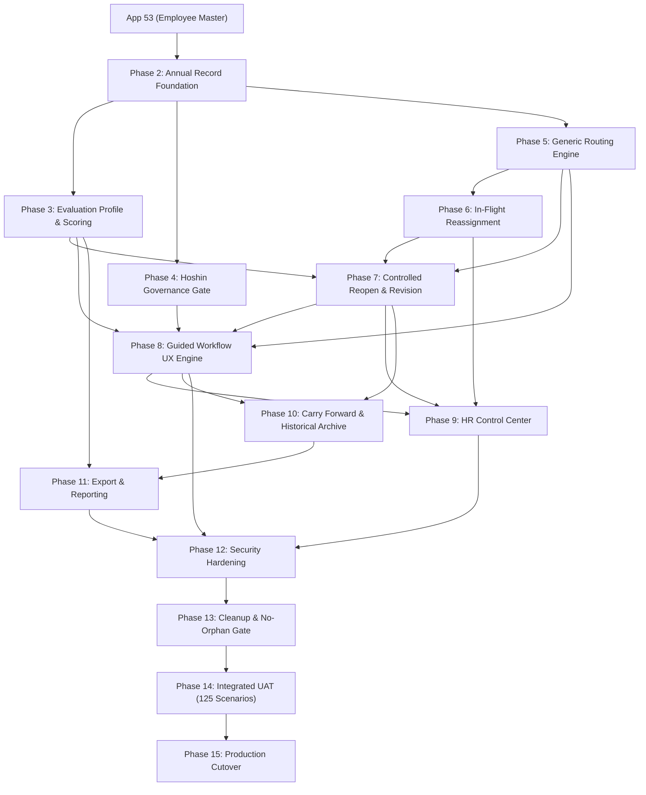

# Implementation Dependency & Critical Path Map

> **Document Status:** Complete  
> **Last Updated:** 2026-08-24  

---

## 1. Technical Dependency Chain

---

## 2. Strict Precondition Rules
1. **Schema Precedence:** Master Apps (App 795, Hoshin, Profile) must be structurally stable before building App 794 transactional integration.
2. **Scoring before UX:** Mathematical scoring engines (`WEIGHTED_PART_A_B`) must pass 100% of unit tests before Guided UX components display calculated scores.
3. **No-Orphan Gate before UAT:** Cleanup and dead-code elimination must occur prior to final UAT to ensure zero deprecated references remain.
