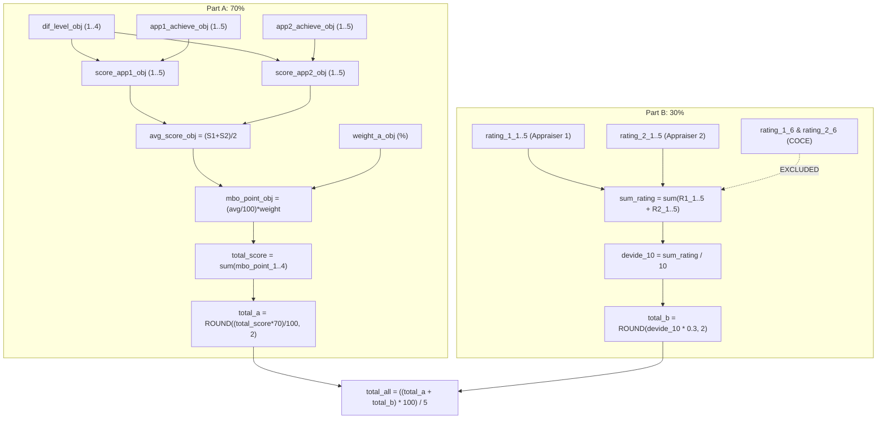

# Kintone Scoring Source of Truth Matrix & Lineage Audit
## Comprehensive Cross-App Analysis of Live Deployed Calculation Engines

> **Governance Principle:** `SCORING_SOURCE_OF_TRUTH = LIVE_KINTONE_FIRST` (User-Confirmed Rule)  
> **Source-of-Truth Priority:**  
> 1. Live Kintone Deployed Configuration (CALC expressions, active fields, JS logic)  
> 2. Recent Kintone Discovery JSON Snapshots  
> 3. Frozen Project Decisions & Documentation  
> 4. Excel Business Artifacts (Secondary Reference for Labels/Descriptions; MUST NOT Override Kintone)  
> **Audit Date:** 2026-08-24T14:54:00+07:00  
> **Access Mode:** Strict Read-Only (`GET` only; 0 writes executed)  
> **Target Apps Audited:** 9 Apps (App 283, 305, 307, 310, 640, 643, 715, 716, 794)  

---

## 1. Executive Summary & Critical Governance Findings

1. **App 310 Weight Split Discovery (`SCORING_ARCHITECTURE_CONFLICT: KINTONE_OVERRIDES_DOC`):**
   - **Live Kintone Deployed State in App 310 (Assistant Manager):**
     - Part A: `total_a = ROUNDUP((total_score * 60) / 100, 2)` $\implies$ **60% Weight**
     - Part B: `sum_part_b = ROUND(devide_10 * 0.4, 2)` $\implies$ **40% Weight**
   - **Conflict Status:** Previous documentation (`DEC-023`) stated all Management profiles were 50/50. Live Kintone establishes Assistant Manager as **60/40**. Under `LIVE_KINTONE_FIRST`, Kintone overrides prior document assumptions.
2. **COCE / Compliance Exclusion Verified 100% in Live Formulas:**
   - In all 8 legacy apps (283, 305, 307, 310, 640, 643, 715, 716), Competency 6 (`rating_1_6` / `rating_2_6`) exists on the form and is evaluated, but is **strictly omitted from `sum_rating`**.
   - Proves `Evaluated = YES`, `Included_In_Score = NO` is the deployed production behavior.
3. **Appraiser Cardinality & Mathematical Normalization:**
   - **Operational Apps (283, 716):** 2 Appraisers $\times$ 5 Scored Competencies $\implies \text{Denominator } = 10$.
   - **Management Apps (305, 307, 310, 643):** 2 Appraisers $\times$ 7 Scored Competencies $\implies \text{Denominator } = 14$.
   - **Executive Apps (640, 715):** 1 Appraiser $\times$ 7 Scored Competencies $\implies \text{Formula: } (\sum \text{Ratings}) \times 2 / 14$ (Equivalently $\sum / 7$).
4. **Final Score Normalization to 100-Point Scale:**
   - Deployed formula across all apps: $\text{Final Score} = ((\text{Part A} + \text{Part B}) \times 100) / 5$ (Normalizing the 5.0 weighted score to a 100-point index).

---

## 2. Kintone Cross-App Scoring Source of Truth Matrix

| Profile / Legacy App | Target Group | Live Part A Formula | Live Part A Wt | Live Part B Formula | Live Part B Wt | Total Competencies | Scored Competencies | Appraiser Count | Live Part B Denominator | Live Final Score Formula | Conflict Status |
| :--- | :--- | :--- | :---: | :--- | :---: | :---: | :---: | :---: | :---: | :--- | :--- |
| **App 283** | Staff & Chief | `total_a_0: ROUND((total_score*70)/100, 2)` | **70%** | `sum_part_b: ROUND(devide_10*0.3, 2)` | **30%** | 6 (COCE incl) | **5** | 2 | `10` (`/10`) | `total_all: ((total_a+total_b)*100)/5` | **CONSISTENT** |
| **App 716** | Japanese Staff | `total_a_0: ROUND((total_score*70)/100, 2)` | **70%** | `sum_part_b: ROUND(devide_10*0.3, 2)` | **30%** | 6 (COCE incl) | **5** | 2 | `10` (`/10`) | `total_all: ((total_a+total_b)*100)/5` | **CONSISTENT** |
| **App 310** | Assistant Manager | `total_a_0: ROUNDUP((total_score*60)/100, 2)` | **60%** | `sum_part_b: ROUND(devide_10*0.4, 2)` | **40%** | 8 (COCE incl) | **7** | 2 | `14` (`/14`) | `total_all: ((total_a+total_b)*100)/5` | **KINTONE_OVERRIDES_DOC (60/40)** |
| **App 305** | Section Manager | `total_a_0: ROUND((total_score*50)/100, 2)` | **50%** | `sum_part_b: ROUND(devide_10*0.5, 2)` | **50%** | 8 (COCE incl) | **7** | 2 | `14` (`/14`) | `total_all: ROUND(((total_a+total_b)*100)/5, 2)`| **CONSISTENT** |
| **App 643** | Senior Manager | `total_a_0: ROUND((total_score*50)/100, 2)` | **50%** | `sum_part_b: ROUND(devide_10*0.5, 2)` | **50%** | 8 (COCE incl) | **7** | 2 | `14` (`/14`) | `total_all: ROUND(((total_a+total_b)*100)/5, 2)`| **CONSISTENT** |
| **App 307** | DGM / GM | `total_a_0: ROUND((total_score*50)/100, 2)` | **50%** | `sum_part_b: ROUND(devide_10*0.5, 2)` | **50%** | 8 (COCE incl) | **7** | 2 | `14` (`/14`) | `total_all: ((total_a+total_b)*100)/5` | **CONSISTENT** |
| **App 640** | General Manager | `total_a_0: ROUND((total_score*50)/100, 2)` | **50%** | `sum_part_b: ROUND(devide_10*0.5, 2)` | **50%** | 8 (COCE incl) | **7** | 1 | `14` (`sum*2/14`) | `total_all: ((total_a+total_b)*100)/5` | **KINTONE_OVERRIDES_DOC (1 Appraiser)`** |
| **App 715** | Vice President | `total_a_0: ROUND((total_score*50)/100, 2)` | **50%** | `sum_part_b: ROUND(devide_10*0.5, 2)` | **50%** | 8 (COCE incl) | **7** | 1 | `14` (`sum*2/14`) | `total_all: ((total_a+total_b)*100)/5` | **KINTONE_OVERRIDES_DOC (1 Appraiser)`** |
| **App 794** | Sandbox Pilot | `PartA_Weighted_Score: ROUND((PartA_Raw*70)/100, 2)` | 70% | `PartB_Weighted_Score: ROUND(PartB_Raw*0.3, 2)` | 30% | 6 (COCE incl) | 5 | 2 | `5` (`/5`) | `Final_Confidential: ((PartA+PartB)*100)/5` | **SCHEMA_DRIFT (Hardcoded Pilot)`** |

---

## 3. Detailed Scoring Calculation Lineage per Profile

### A. Staff & Chief / Japanese Staff (App 283 / App 716 - 70/30 Profile)

### B. Assistant Manager (App 310 - 60/40 Profile)
* **Part A:** `total_a = ROUNDUP((total_score * 60) / 100, 2)`
* **Part B:** `sum_rating = sum(ratings 1..5, 7..8 for App 1 & 2)` ($N=7 \times 2 = 14$), `devide_10 = ROUND(sum_rating / 14, 2)`, `total_b = ROUND(devide_10 * 0.4, 2)`
* **Final:** `total_all = ((total_a + total_b) * 100) / 5`

### C. Section Manager / Senior Manager / DGM (App 305 / 643 / 307 - 50/50 Profile)
* **Part A:** `total_a = ROUND((total_score * 50) / 100, 2)`
* **Part B:** `sum_rating = sum(ratings 1..5, 7..8 for App 1 & 2)` ($N=7 \times 2 = 14$), `devide_10 = ROUND(sum_rating / 14, 2)`, `total_b = ROUND(devide_10 * 0.5, 2)`
* **Final:** `total_all = ROUND(((total_a + total_b) * 100) / 5, 2)`

### D. General Manager / Vice President (App 640 / 715 - 50/50 Profile with 1 Appraiser)
* **Part A:** `total_a = ROUND((total_score * 50) / 100, 2)`
* **Part B:** `sum_rating = (rating_1_1+1_2+1_3+1_4+1_5+1_7+1_8) * 2`, `devide_10 = ROUND(sum_rating / 14, 2)`, `total_b = ROUND(devide_10 * 0.5, 2)`
* **Final:** `total_all = ((total_a + total_b) * 100) / 5`

---

## 4. Objective Difficulty x Achievement Matrix Verification

Live CALC expression for `score_app1_obj1` across all legacy apps:
$$\begin{array}{|c|c|c|c|c|c|}
\hline
\textbf{Difficulty} \backslash \textbf{Achievement} & \textbf{Level 1} & \textbf{Level 2} & \textbf{Level 3} & \textbf{Level 4} & \textbf{Level 5} \\
\hline
\textbf{Level 4 (High)} & 2 & 3 & 4 & 4 & 5 \\
\hline
\textbf{Level 3 (Med-High)} & 2 & 2 & 3 & 4 & 4 \\
\hline
\textbf{Level 2 (Medium)} & 1 & 1 & 2 & 3 & 3 \\
\hline
\textbf{Level 1 (Basic)} & 1 & 1 & 2 & 2 & 2 \\
\hline
\end{array}$$

* **Verification Status:** **`MATRIX_IDENTICAL_ACROSS_APPS`** (Verified identical across App 283, 305, 307, 310, 640, 643, 715, 716).

---

## 5. Conflict Resolution & Document Alignment Actions

| Discrepancy | Previous Assumption | Live Kintone Primary Truth | Resolution Action |
| :--- | :--- | :--- | :--- |
| **Assistant Manager Weights** | 50% Part A / 50% Part B (`DEC-023`) | **60% Part A / 40% Part B** (App 310) | **KINTONE_OVERRIDES_DOC:** Update configuration model to support 60/40 for Assistant Manager. |
| **GM / VP Appraiser Cardinality** | 1–2 Appraisers generic | **1 Appraiser** evaluated, mathematically normalized via `(sum*2)/14` | **KINTONE_OVERRIDES_DOC:** Formalize single appraiser scaling model. |
| **COCE Exclusion** | COCE excluded by rule | **Item 6 excluded from `sum_rating`** across 100% of apps | **CONSISTENT:** Confirmed by live Kintone formula. |
